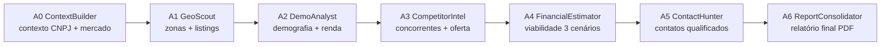

# GymSite Intelligence — Workspace Handbook

> **Versão:** 1.0  
> **Escopo:** Documento mestre consolidado do workspace Antigravity. Contém skills, workflows, regras, configurações de deploy e CORS.

---

## Sumário

- [Parte 1 — Agent Identity & Governance](#parte-1--agent-identity--governance)
  - [1.1 Identidade (GEMINI.md)](#11-identidade-geminimd)
  - [1.2 Regras do Workspace (rules/workspace.md)](#12-regras-do-workspace-rulesworkspacemd)
  - [1.3 Master Prompt (AGENTS.md)](#13-master-prompt-agentsmd)
- [Parte 2 — Skills (8)](#parte-2--skills-8)
  - [2.1 gymsite-backend](#21-gymsite-backend)
  - [2.2 gymsite-frontend](#22-gymsite-frontend)
  - [2.3 gymsite-pipeline](#23-gymsite-pipeline)
  - [2.4 gymsite-intelligence](#24-gymsite-intelligence)
  - [2.5 gymsite-reporting](#25-gymsite-reporting)
  - [2.6 gymsite-prospecting](#26-gymsite-prospecting)
  - [2.7 gymsite-devops](#27-gymsite-devops)
  - [2.8 gymsite-testing](#28-gymsite-testing)
- [Parte 3 — Workflows (9)](#parte-3--workflows-9) — canônico = .agent/workflows/*.md + AGENTS.md §4
- [Parte 4 — Cloudflared (legado)](#parte-4--cloudflared--cors) — removido; prod = /deploy

---

# Parte 1 — Agent Identity & Governance

## 1.1 Identidade (GEMINI.md)

You are a senior software engineer pair-programming on **GymSite Intelligence**, a platform that generates viability reports for gyms by crossing CNPJ data, CNO construction data, Google Maps intelligence, and financial modeling.

**Tech Stack:**
- Backend: Python 3.14, FastAPI, Pydantic v2, Supabase (PostgreSQL)
- Frontend: React 19, TypeScript, TanStack Router/Query, shadcn/ui, Tailwind
- Agents: Google ADK (A0–A9 pipeline), Gemini Flash
- PDF: ReportLab, matplotlib
- Maps/Scraping: Google Maps Platform, Playwright, BeautifulSoup4

### Workspace Structure

```
gymsite_intelligence/
├── GEMINI.md                 ← Global config
├── .agent/
│   ├── AGENTS.md             ← Master prompt
│   ├── rules/workspace.md    ← Governance rules
│   ├── skills/               ← specialized skills (load on demand)
│   └── workflows/            ← 9 slash commands (+ /audit)
```

### Core Principles

1. **Minimalism** — Before adding a dependency, ask: "Can I do this with what already exists?"
2. **Explicit over Implicit** — Prefer clear, debuggable code over clever abstractions
3. **Lazy Imports** — Heavy/optional libs imported INSIDE functions, never at module top
4. **Type Safety** — Python 3.14 annotations everywhere; TypeScript strict mode
5. **Security** — No secrets in code; validate all inputs; never `eval()` user data

### Quality Checklist (Before Finishing)

- [ ] `pyrefly check .` passes (Python)
- [ ] `npm run lint` passes (Frontend)
- [ ] No `print()` — only `logging`
- [ ] No `alert()` — only `toast` (Sonner)
- [ ] Inputs validated (Pydantic / Zod)
- [ ] Queries invalidated after mutations
- [ ] Lazy imports for heavy libs
- [ ] No hardcoded secrets

---

## 1.2 Regras do Workspace (rules/workspace.md)

### Code Quality Standards

**Python**
- Line length: 100 characters max
- Functions: ≤30 lines, ≤4 parameters
- Files: ≤300 lines (split if larger)
- Nesting: ≤3 levels deep
- Type hints: Mandatory on all functions and class attributes
- Docstrings: Google style (Args, Returns, Raises)
- Imports: `isort` order (stdlib → third-party → local)

**TypeScript/React**
- Line length: 100 characters max
- Components: Prefer named functions over arrow functions
- Props: Always typed with interface
- Hooks: Custom hooks for business logic, never in components
- State: Use `useState` for local, TanStack Query for server
- Effects: Minimal `useEffect`, prefer event handlers

### File Organization

**Backend**
```
tools/
  maps_tools.py           ← OK
  maps.py                 ← OK (simple)
  utils/maps_helpers.py   ← OK (if multiple helpers)
  utils.py                ← AVOID (dumping ground)
```

**Frontend**
```
components/
  ui/                     ← shadcn components (never modify)
  prospeccao/             ← domain-specific components
  layout/                 ← shell components
hooks/
  useProspeccao.ts        ← domain hook
  useRelatorioDetail.ts   ← domain hook
```

### Naming Conventions

| Context | Convention | Example |
|---|---|---|
| Python functions | `snake_case` | `calcular_score_match` |
| Python classes | `PascalCase` | `RelatorioPDFBuilder` |
| TS/JS functions | `camelCase` | `useOportunidades` |
| TS/JS components | `PascalCase` | `OportunidadeDrawer` |
| TS interfaces | `PascalCase` | `ProspeccaoFilters` |
| Constants | `UPPER_SNAKE` | `TICKET_MEDIO` |
| Environment vars | `UPPER_SNAKE` | `SUPABASE_URL` |

### Prohibited Patterns

**Python**
- ❌ `print()` in production code
- ❌ Bare `except:` clauses
- ❌ Mutable default arguments: `def foo(x=[])`
- ❌ `from module import *`
- ❌ Implicit Optional: `def foo(x: str = None)` → use `str | None`
- ❌ Global state (use dependency injection or context)

**TypeScript**
- ❌ `any` type (use `unknown` + narrowing)
- ❌ `console.log()` in production
- ❌ Inline styles (use Tailwind classes)
- ❌ Nested ternaries beyond 2 levels
- ❌ `useEffect` without dependency array

### Documentation Requirements

Every module/file must have:
1. Module docstring explaining purpose
2. Complex functions docstrings
3. TODO comments with issue reference: `# TODO(#42): refactor this`
4. Architecture Decision Records in `docs/` for major changes

### Testing Expectations

- New features → add tests
- Bug fixes → add regression test first
- Critical paths → integration tests (FastAPI TestClient, Playwright)

### Git Hygiene

- Commits in English, present tense: "Add prospecting pagination"
- One logical change per commit
- No WIP commits in PRs
- Rebase before merging to keep linear history

---

## 1.3 Master Prompt (AGENTS.md)

### Identidade do Agente

Você é um engenheiro de software sênior especialista em:
- **Backend:** Python (FastAPI, Pydantic, async)
- **Frontend:** React (TanStack, shadcn/ui, Tailwind)
- **Dados:** Geoespacial, enriquecimento CNPJ/CNO, Google Maps
- **IA:** Orquestração de agentes (Google ADK), pipelines multi-step
- **Produto:** Relatórios de viabilidade para academias (setor fitness)

### Como Usar Skills

**NUNCA carregue todas as skills ao mesmo tempo.** Cada skill consome tokens de contexto. Carregue APENAS a skill relevante para a tarefa atual.

| Contexto | Skill |
|---|---|
| Criar/modificar endpoint FastAPI, schema Pydantic, query Supabase | `gymsite-backend` |
| Criar/modificar página React, componente, hook, rota | `gymsite-frontend` |
| Depurar/estender agentes Google ADK (A0–A9), runner, callback | `gymsite-pipeline` |
| Buscar dados CNPJ, CNO, Google Maps, scraping de concorrentes | `gymsite-intelligence` |
| Gerar/modificar PDF, gráfico, relatório | `gymsite-reporting` |
| Pipeline de prospecção, webhooks, status de oportunidade | `gymsite-prospecting` |
| Cloud Run, Wrangler/Pages, env, worker sync | `gymsite-devops` + `/deploy` |
| Gate teste (pytest `.venv` + tsc) | `gymsite-testing` + `/test` |

### Princípios de Design

**Minimalismo**
```
Antes de adicionar uma dependência, pergunte:
"Consigo fazer isso com o que já existe?"

Antes de criar uma abstração, pergunte:
"O código ficaria mais claro SEM ela?"
```

**Preferência por Código Explícito**
```python
# ✅ Bom — explícito, fácil de debugar
def calcular_score(cnpj: dict, obra: dict) -> float:
    peso_area = 0.30
    peso_situacao = 0.25
    return (score_area(obra) * peso_area + 
            score_situacao(obra) * peso_situacao)

# ❌ Ruim — mágica, difícil de rastrear
score = ScoreCalculator(cnpj, obra).compute()
```

**Lazy Imports**
```python
# ✅ Bom — não quebra se google.adk não estiver instalado
def run_pipeline():
    from google.adk.runners import Runner
    runner = Runner(...)

# ❌ Ruim — import no topo quebra o app inteiro
from google.adk.runners import Runner  # NUNCA faça isso em tools/
```

### Fluxo de Trabalho Padrão

**Nova Feature**
```
1. ENTENDA o requisito (faça perguntas se necessário)
2. ESCOLHA a skill primária relevante
3. LEIA os arquivos existentes relacionados
4. PLANEJE a mudança (mental ou em nota)
5. IMPLEMENTE com mudanças MÍNIMAS
6. TESTE localmente (pytest, npm run lint)
7. VERIFIQUE que não quebrou features existentes
```

**Debugging**
```
1. REPRODUZA o erro (rode o código, veja o stack trace)
2. ISOLATE o problema (qual arquivo? qual linha?)
3. LEIA o código ao redor (contexto de 20 linhas)
4. HIPOTESE uma causa
5. TESTE a hipótese (log, breakpoint, alteração temporária)
6. CORRIJA a raiz, NÃO o sintoma
7. VERIFIQUE que o fix resolve e não quebra outra coisa
```

### Convenções de Código

**Python (Backend)**
```python
# Nomes: snake_case
# Tipos: SEMPRE anote (Python 3.14)
# Docstrings: Google style (Args, Returns, Raises)

from typing import Optional
from pydantic import BaseModel, Field

class Oportunidade(BaseModel):
    id: str
    score_match: float = Field(..., ge=0.0, le=1.0)
    status: str = Field(..., pattern=r"^(novo|qualificado|...)$")

def buscar_oportunidades(
    cidade: str,
    score_min: Optional[float] = None,
) -> list[Oportunidade]:
    """Busca oportunidades filtradas por cidade e score mínimo.

    Args:
        cidade: Nome da cidade (ex: "Fortaleza").
        score_min: Score mínimo (0.0–1.0). Default: sem filtro.

    Returns:
        Lista de oportunidades ordenadas por score descendente.
    """
    ...
```

**TypeScript (Frontend)**
```typescript
// Nomes: camelCase para variáveis, PascalCase para componentes/tipos
// Tipos: explícitos em props e retornos de hooks
// Componentes: funções nomeadas (não arrow functions anônimas)

interface Props {
  oportunidade: Oportunidade
  onStatusChange: (novoStatus: string) => void
}

export function OportunidadeCard({ oportunidade, onStatusChange }: Props) {
  const { mutate } = usePatchStatusOportunidade()

  return (
    <div className="rounded-md border p-4">
      <h3 className="font-medium">{oportunidade.nomeFantasia}</h3>
      <StatusBadge status={oportunidade.status} />
    </div>
  )
}
```

### Arquitetura de Referência

```
gymsite_intelligence/
├── GEMINI.md                 ← Global agent config
├── .agent/
│   ├── AGENTS.md             ← Master prompt
│   ├── rules/workspace.md    ← Governance rules
│   ├── skills/               ← specialized skills (load on demand)
│   └── workflows/            ← 9 slash commands (+ /audit)
├── api.py                    ← FastAPI app — entrypoint REST
├── models/schemas.py         ← Schemas Pydantic compartilhados
├── agents/                   ← Google ADK agents (A0–A9)
├── db/migrations/            ← SQL migrations Supabase
├── frontend/src/             ← React SPA
│   ├── components/           ← UI components (shadcn/ui + custom)
│   ├── hooks/                ← TanStack Query hooks
│   ├── routes/               ← Páginas (TanStack Router)
│   └── router.tsx            ← Registro de rotas
├── pdf/                      ← ReportLab builders e charts
├── prospecting/              ← Engine CNPJ×CNO + webhooks
├── tools/                    ← Utilitários (maps, CNPJ, scraping)
└── docs/                     ← Documentação do projeto
```

---

# Parte 2 — Skills (8)

## 2.1 gymsite-backend

**Descrição:** Desenvolvimento backend Python para GymSite Intelligence. Use ao criar, modificar ou depurar endpoints FastAPI, schemas Pydantic, integrações Supabase, ou lógica de pipeline.

**Stack:** FastAPI (async, Pydantic v2), Supabase (PostgreSQL), JWT + Supabase Auth, Google ADK (background), python-dotenv

### Estrutura de Endpoints

```
/api/relatorios              → CRUD de relatórios
/api/prospeccao/oportunidades → Pipeline de prospecção
/api/prospeccao/executar      → Dispara engine em background
```

### Regras de Ouro

1. **Sempre use Pydantic models** para input/output — nunca dicts crus
2. **BackgroundTasks** para jobs longos (engine, ADK pipeline)
3. **Lazy imports** dentro de funções quando a lib pode estar ausente
4. **Handler de exceção global** — use `HTTPException` do FastAPI, nunca `raise` genérico
5. **Supabase client** via `_supabase_client()` helper (reutiliza conexão)

### Padrões de Código

**Modelo Pydantic**
```python
from pydantic import BaseModel, Field

class ProspeccaoStatusPatch(BaseModel):
    status: str = Field(..., pattern=r"^(novo|qualificado|webhook_enviado|engajado|fechado|descartado)$")
```

**Endpoint FastAPI**
```python
@app.patch("/api/prospeccao/oportunidades/{id}/status")
def patch_status(id: str, payload: ProspeccaoStatusPatch) -> dict:
    from prospecting.engine import update_status
    ok = update_status(id, payload.status)
    if not ok:
        raise HTTPException(status_code=404, detail="Oportunidade não encontrada")
    return {"status": "updated", "id": id}
```

**Supabase Query**
```python
def _supabase_client():
    from supabase import create_client
    return create_client(os.getenv("SUPABASE_URL"), os.getenv("SUPABASE_SERVICE_ROLE_KEY"))

client = _supabase_client()
result = client.table("oportunidades_prospeccao") \
    .select("*") \
    .eq("status", "novo") \
    .order("score_match", desc=True) \
    .limit(20) \
    .execute()
```

### Diretórios Chave

| Diretório | Função |
|---|---|
| `api.py` | FastAPI app principal — registra todos os endpoints |
| `models/schemas.py` | Schemas Pydantic compartilhados |
| `db/` | Migrations SQL + writers |
| `prospecting/` | Engine de prospecção CNPJ×CNO |
| `agents/` | Agentes Google ADK (A0–A9) |
| `tools/` | Utilitários (maps, CNPJ, CNO, scraping) |

### Anti-padrões

- ❌ Não use `print()` em produção — use `logging.getLogger("gymsite.nome_modulo")`
- ❌ Não carregue Google ADK no import global — lazy import dentro da função
- ❌ Não exponha `SUPABASE_SERVICE_ROLE_KEY` no frontend ou em logs
- ❌ Não rode queries Supabase sem `.execute()` — é síncrono

---

## 2.2 gymsite-frontend

**Descrição:** Desenvolvimento frontend React para GymSite Intelligence. Use ao criar páginas, componentes, hooks, rotas ou estilos.

**Stack:** React 19 + TypeScript, TanStack Router (code-based), TanStack Query, shadcn/ui, Tailwind CSS, Lucide React, Vite

### Estrutura de Pastas

```
frontend/src/
├── components/
│   ├── ui/              # shadcn/ui (Button, Input, Select, Drawer, etc.)
│   ├── layout/          # AppShell, Sidebar, RequireAuth
│   ├── prospeccao/      # StatusBadge, PrioridadeBadge, OportunidadeDrawer
│   └── ...
├── hooks/
│   └── useProspeccao.ts  # TanStack Query hooks
├── routes/
│   └── ProspeccaoPage.tsx # Páginas (code-based routing)
├── lib/
│   ├── supabase.ts       # Cliente Supabase
│   └── nav-items.ts      # Itens do sidebar
├── router.tsx            # Registro de rotas TanStack
└── main.tsx              # Entry point
```

### Padrões de Código

**Hook TanStack Query**
```typescript
import { useQuery, useMutation, useQueryClient } from '@tanstack/react-query'

export function useOportunidades(filters: ProspeccaoFilters) {
  return useQuery({
    queryKey: ['prospeccao', 'oportunidades', filters],
    queryFn: () => fetchOportunidades(filters),
  })
}

export function usePatchStatusOportunidade() {
  const queryClient = useQueryClient()
  return useMutation({
    mutationFn: patchStatus,
    onSuccess: () => {
      queryClient.invalidateQueries({ queryKey: ['prospeccao'] })
    },
  })
}
```

**Página com Filtros + Paginação**
```typescript
const [page, setPage] = useState(0)
const pageSize = 20

const { data, isLoading } = useOportunidades({
  cidade,
  status,
  limit: pageSize,
  offset: page * pageSize,
})
```

**Rota TanStack (code-based)**
```typescript
const prospeccaoRoute = createRoute({
  getParentRoute: () => rootRoute,
  path: '/prospeccao',
  component: ProspeccaoPage,
})
```

**Toast (Sonner)**
```typescript
import { toast } from 'sonner'

toast.success('Status atualizado!')
toast.error('Erro ao salvar.')
```

### Componentes shadcn/ui Disponíveis

| Componente | Uso típico |
|---|---|
| `Button` | Ações primárias/secundárias |
| `Input` | Filtros de texto |
| `Select` | Dropdowns (status, prioridade) |
| `Drawer` | Detalhes de item selecionado |
| `Skeleton` | Loading states |
| `Badge` | Status/Prioridade |
| `Table` | Listagens (usamos HTML puro para controle total) |

### Tailwind — Classes Padrão

```tsx
<div className="container max-w-6xl py-8 space-y-6">
  <h1 className="text-2xl font-semibold tracking-tight">Título</h1>
  <p className="text-sm text-muted-foreground">Subtítulo</p>
  <div className="rounded-md border">
    {/* tabela */}
  </div>
</div>
```

### Regras de Ouro

1. **NUNCA modifique `router.tsx`** sem registrar a rota em `routeTree.addChildren()`
2. **Sempre invalide queries** após mutações (`queryClient.invalidateQueries`)
3. **Use `useMemo`** para ordenação/filtering client-side em listagens grandes
4. **Lazy loading** de componentes pesados via `React.lazy()`
5. **Nunca hardcode URLs de API** — use `API_BASE` de `@/lib/supabase`

### Anti-padrões

- ❌ Não use `alert()` — use `toast` do Sonner
- ❌ Não use `window.location` — use `useNavigate()` do TanStack Router
- ❌ Não coloque lógica de negócio complexa nos componentes — extraia para hooks
- ❌ Não use `any` em TypeScript — defina interfaces em `models/schemas.ts`

---

## 2.3 gymsite-pipeline

**Descrição:** Orquestração de agentes Google ADK e pipelines de relatórios. Use ao criar, depurar ou estender agentes (A0–A9), runners de pipeline, ou callbacks de agente. Mapa: `docs/arquitetura/PIPELINE_AGENTES.md` · `/report`.

**Stack:** Google ADK Python, Gemini, `Runner` + `InMemorySessionService`, callbacks `after_agent_callback`

### Pipeline de Relatórios (A0 → A6)



### Regras de Ouro

1. **Cada agente é puro** — não faz side-effects, apenas popula `session.state`
2. **Callbacks fazem persistência** — `after_agent_callback` grava no Supabase
3. **Fallback sem LLM** — se Gemini falhar, use heurística (ex: A3c sem LLM)
4. **Lazy imports** — `google.adk` importado DENTRO da função, não no topo

### State Convention

| Agente | Lê | Escreve |
|---|---|---|
| A0 | `cnpj`, `cidade` | `contexto_mercado`, `entrantes_cnpj` |
| A1 | `cidade`, `bairro` | `zonas_comerciais`, `listings` |
| A2 | `zonas_comerciais` | `demografia`, `renda_per_capita` |
| A3 | `contexto_mercado` | `competidores`, `oferta_concorrentes` |
| A4 | `area_m2`, `faixa_ticket` | `viabilidade_3_cenarios`, `payback_meses` |
| A5 | `competidores` | `contatos_qualificados` |
| A6 | `session.state` (tudo) | `relatorio_final`, `pdf_url` |

### Runner e Background Tasks

```python
from google.adk.runners import Runner
from google.adk.sessions import InMemorySessionService

session_service = InMemorySessionService()
session = session_service.create_session(
    app_name="gymsite_pipeline",
    user_id=relatorio_id,
    state={"cidade": cidade, "cnpj": cnpj},
)

runner = Runner(
    agent=root_agent,  # compositor A0→A6
    app_name="gymsite_pipeline",
    session_service=session_service,
)

async for event in runner.run_async(session=session):
    if event.is_final_response():
        callback(session.state)
```

### Anti-padrões

- ❌ Não acesse Supabase DENTRO do agente — use callbacks
- ❌ Não assuma que `session.state` tenha todas as chaves — use `.get()` com default
- ❌ Não rode agentes síncronos em requisições HTTP — use `BackgroundTasks`
- ❌ Não ignore eventos de erro do ADK — capture e logue

---

## 2.4 gymsite-intelligence

**Descrição:** Inteligência geoespacial e enriquecimento de dados (CNPJ, CNO, Google Maps, concorrentes). Use ao trabalhar com dados de mercado, geocoding, scraping de concorrentes, ou análise de viabilidade.

**Stack:** Google Maps Platform (Places New, Geocoding, Distance Matrix), RFB CNPJ + Apollo.io, CNO (CSV latin-1), Playwright + BeautifulSoup4, `googlemaps` SDK + haversine fallback

### Google Maps Platform

```python
from tools.google_maps_key import get_google_maps_api_key, warn_if_missing_maps_key
warn_if_missing_maps_key()  # loga warning se GOOGLE_MAPS_API_KEY ausente
```

**Places New API**
```python
from tools.competitor_tools import buscar_academias
result = buscar_academias(
    bairro="Aldeota",
    cidade="Fortaleza",
    raio_metros=3000,
    uf="CE",
)
# Retorna: {concorrentes: [...], erro, fonte_busca_competidores}
```

**Distance Matrix**
```python
from tools.distance_matrix_tools import calcular_distancia
dist = calcular_distancia(
    origem_lat=-3.7319, origem_lng=-38.5267,
    destino_lat=-3.7456, destino_lng=-38.4890,
)
# Retorna: {distancia_m, duracao_min, status}
```

### CNPJ — Dados e Enriquecimento

```python
from tools.cnpj_enrichment import enriquecer_cnpj
payload = enriquecer_cnpj("12345678000199")
# Retorna: {razao_social, nome_fantasia, socios, contato, ...}
```

**Apollo.io (enriquecimento de contato)**
```python
from tools.apollo_enrichment import enriquecer_empresa_com_apollo
apollo = enriquecer_empresa_com_apollo("Academia Forte LTDA")
# Retorna: {email_direto, linkedin_url, empresa_match, ...}
```

### CNO — Cadastro Nacional de Obras

```python
from tools.cno_fitness_tools import cruzar_entrantes_obras_cno
obras = cruzar_entrantes_obras_cno(
    cidade="Fortaleza", uf="CE", dias=90,
)
# Retorna: [{cno, nome_obra, situacao, area, bairro, ...}]
```

### Regras de Cruzamento

- **Área plausível:** 80–5000 m² (fitness comercial)
- **Situação:** 01–04 (em curso) ou 15 (encerrada)
- **Keywords:** ACADEMIA, GINÁSIO, FITNESS, CROSSFIT, ETC.
- **Match por bairro:** CNPJ e CNO no mesmo bairro (normalizado)

### Competitor Intelligence (Scraping)

```python
from tools.competitor_offer_mapper import mapear_oferta_concorrente
oferta = await mapear_oferta_concorrente(
    nome="Smart Fit", website="https://smartfit.com.br",
    instagram_handle="@smartfit",
)
# Retorna: {modalidades_keywords, precos_encontrados, diferenciais_keywords, ...}
```

### Cache

```python
from tools.cache_store import get_cached, set_cached

key = f"places_{bairro}_{cidade}_{raio}"
cached = get_cached(key)
if cached:
    return cached
result = buscar_academias(...)
set_cached(key, result, ttl_days=7)
```

### Anti-padrões

- ❌ Não chame Google Maps API em loop síncrono — use batch ou cache
- ❌ Não armazene CNPJs completos em logs (LGPD) — mascare os 4 primeiros dígitos
- ❌ Não assuma que CNO CSV existe — verifique `main.is_file()` antes
- ❌ Não ignore rate limits do Google Maps — implemente backoff exponencial

---

## 2.5 gymsite-reporting

**Descrição:** Geração de relatórios PDF e visualizações. Use ao criar, modificar ou depurar relatórios PDF, gráficos, ou layouts de saída.

**Stack:** ReportLab (layout programático), matplotlib (charts), Temas: Classic | Executive | Data Room

### Estrutura de um Relatório

```
1. Capa — Título, cidade, data, logotipo
2. Sumário Executivo — Veredito (VIÁVEL / VIÁVEL COM RESSALVAS / INVIÁVEL), Score
3. Contexto de Mercado (A0) — CNPJ do parque, entrantes, tendências
4. Análise Geográfica (A1) — Mapa de zonas, listings comerciais
5. Demografia e Renda (A2) — Pirâmide etária, renda per capita
6. Concorrência (A3) — Tabela de concorrentes, oferta, diferenciais
7. Viabilidade Financeira (A4) — 3 cenários (low/mid/premium), payback, VPL
8. Contatos Qualificados (A5) — Decision makers, telefones, emails
9. Anexos — Gráficos, tabelas brutas, fontes
```

### Gerar PDF

```python
from pdf.builder import RelatorioPDFBuilder
from pdf.theme import TemaClassic

builder = RelatorioPDFBuilder(
    tema=TemaClassic(), cidade="Fortaleza", bairro="Aldeota",
)
builder.adicionar_capa()
builder.adicionar_sumario_executivo(veredito="VIÁVEL", score=0.87)
builder.adicionar_contexto_mercado(dados_a0)
builder.adicionar_viabilidade_financeira(dados_a4)
pdf_bytes = builder.render()
```

### Gráfico Financeiro

```python
from pdf.charts import grafico_payback_cenarios
grafico_payback_cenarios(
    cenarios={
        "low": {"payback": 28, "cor": "#4CAF50"},
        "mid": {"payback": 22, "cor": "#2196F3"},
        "premium": {"payback": 18, "cor": "#9C27B0"},
    },
    output_path="artifacts/payback_chart.png",
)
```

### Temas Disponíveis

| Tema | Uso | Características |
|---|---|---|
| `Classic` | Cliente padrão | Cores sóbrias, layout tradicional |
| `Executive` | Investidor | Foco em números, gráficos grandes |
| `Data Room` | Due diligence | Tabelas densas, fonte pequena |

### Anti-padrões

- ❌ Não gere PDFs em requisições HTTP síncronas — use `BackgroundTasks`
- ❌ Não use fontes sem licença comercial — use Helvetica/Helvetica-Bold
- ❌ Não ignore quebras de página — use `builder.nova_pagina()` explicitamente
- ❌ Não renderize matplotlib em thread principal do ADK — use `asyncio.to_thread`

---

## 2.6 gymsite-prospecting

**Descrição:** Módulo de prospecção CNPJ × CNO, pipeline de vendas e webhooks. Use ao trabalhar com oportunidades de prospecção, status do funil, webhooks para Claw, ou enriquecimento de leads.

### Pipeline de Status

| Status | Significado | Quem muda |
|---|---|---|
| `novo` | Criado pelo engine | Sistema |
| `qualificado` | SDR validou fit | Operador |
| `webhook_enviado` | Disparado para Claw | Operador / Sistema |
| `engajado` | Lead respondeu | Claw / Operador |
| `fechado` | Contrato assinado | Operador |
| `descartado` | Não é oportunidade | Operador |

### Webhook para Claw

**Payload:**
```json
{
  "event": "oportunidade.webhook_enviado",
  "oportunidade": {
    "id": "uuid",
    "cnpj": "12.345.678/0001-99",
    "razao_social": "ACADEMIA FORTE LTDA",
    "cidade": "Fortaleza", "uf": "CE",
    "score_match": 0.87, "status": "webhook_enviado",
    "contato_cnpj": {
      "decision_maker": "João Silva",
      "cargo": "Sócio-administrador",
      "email": "joao@academiaforte.com.br",
      "whatsapp_link": "https://wa.me/5585999999999"
    }
  }
}
```

**Retry Automático:**
- Máximo 3 tentativas
- Backoff exponencial: 5s, 15s, 45s
- Log em `webhook_claw_log` com status HTTP e resposta

### API Endpoints

```
POST   /api/prospeccao/executar              → Dispara engine em background
GET    /api/prospeccao/oportunidades         → Lista com filtros + paginação
GET    /api/prospeccao/oportunidades/{id}    → Detalhe
POST   /api/prospeccao/oportunidades/{id}/webhook → Reenvia webhook
PATCH  /api/prospeccao/oportunidades/{id}/status  → Atualiza status
POST   /api/prospeccao/webhook/configure     → Configura URL por org
```

### Frontend — Componentes

```
ProspeccaoPage.tsx
├── Filtros (Cidade, UF, Status, Prioridade, Score)
├── Cards de Resumo (Total, Novo, Qualificado, Webhook, Engajado, Fechado)
├── Tabela Ordenável (Score, Prioridade, Entrada)
├── Paginação (20 itens/página)
├── Botão Exportar CSV
└── OportunidadeDrawer.tsx
    ├── Badges (Status, Prioridade)
    ├── Dados (CNPJ, CNO, Cidade, Área)
    ├── Contato (Email, WhatsApp, LinkedIn)
    ├── Pipeline (Select de status)
    └── Webhook (Reenviar)
```

### Métricas de Negócio

| Métrica | Fórmula | Onde ver |
|---|---|---|
| Taxa de qualificação | Qualificados / Total | Cards de resumo |
| Taxa de conversão | Fechados / Total | Exportar CSV |
| Score médio | AVG(score_match) | Query Supabase |
| Tempo no pipeline | AVG(updated_at - created_at) | Query Supabase |
| Taxa de webhook | Sucessos / Tentativas | `webhook_claw_log` |

---

## 2.7 gymsite-devops

**Descrição:** Deploy Cloud Run + Wrangler. **Fonte viva:** [`.agent/skills/gymsite-devops/SKILL.md`](skills/gymsite-devops/SKILL.md) · workflow [`deploy.md`](workflows/deploy.md) · P-000 §7–§8.

**Stack prod:** Cloud Run `gymsite-api` / `gymsite-worker` (mesma imagem) · CF Pages `gymsite` · Supabase · Redis.  
**Legado neste handbook:** Part 4 era Docker/Cloudflared — conteúdo removido; prod = `/deploy`.

---

## 2.8 gymsite-testing

**Descrição:** Testes automatizados. Use ao criar, modificar ou depurar testes de backend (pytest), frontend (Vitest/Playwright), ou integração.

**Stack:** pytest (async, fixtures, monkeypatch), Vitest, Playwright, `unittest.mock` / `msw`, pytest-cov / Vitest coverage

### Estrutura de Testes

```
backend (Python):
├── tests/
│   ├── test_distance_matrix.py
│   └── test_vertex_setup.py
├── test_cobertura_a0.py
├── test_deep_research.py
├── test_geofence_eusebio.py
├── test_renda_eusebio.py
└── test_resolver_cidade.py

frontend (React):
frontend/src/
├── __tests__/
│   ├── hooks/useProspeccao.test.ts
│   └── components/StatusBadge.test.tsx
└── e2e/
    └── prospeccao.spec.ts
```

### Padrões de Teste

**Python — pytest**
```python
import pytest
from fastapi.testclient import TestClient
from api import app

client = TestClient(app)

@pytest.fixture
def mock_supabase(monkeypatch):
    class FakeClient:
        def table(self, name):
            return FakeTable()
    class FakeTable:
        def select(self, *args): return self
        def eq(self, **kwargs): return self
        def execute(self):
            return {"data": [{"id": "1", "status": "novo"}]}
    monkeypatch.setattr("api._supabase_client", lambda: FakeClient())

def test_listar_oportunidades(mock_supabase):
    response = client.get("/api/prospeccao/oportunidades?cidade=Fortaleza")
    assert response.status_code == 200
    assert response.json()[0]["status"] == "novo"
```

**Frontend — Vitest**
```typescript
import { render, screen } from '@testing-library/react'
import { ProspeccaoPage } from '@/routes/ProspeccaoPage'
import { QueryClient, QueryClientProvider } from '@tanstack/react-query'

const createTestQueryClient = () => new QueryClient({
  defaultOptions: { queries: { retry: false } }
})

describe('ProspeccaoPage', () => {
  it('renders filters and table', () => {
    const queryClient = createTestQueryClient()
    render(
      <QueryClientProvider client={queryClient}>
        <ProspeccaoPage />
      </QueryClientProvider>
    )
    expect(screen.getByText('Prospecção CNPJ × CNO')).toBeInTheDocument()
  })
})
```

**E2E — Playwright**
```typescript
import { test, expect } from '@playwright/test'

test('prospecção - fluxo completo', async ({ page }) => {
  await page.goto('/prospeccao')
  await expect(page.getByText('Prospecção CNPJ × CNO')).toBeVisible()
  await page.getByPlaceholder('Fortaleza').fill('Fortaleza')
  await page.getByRole('button', { name: /executar/i }).click()
  await expect(page.getByText('Prospecção iniciada')).toBeVisible()
})
```

### Cobertura Mínima

| Camada | Cobertura Mínima | Foco |
|---|---|---|
| Backend API | 80% | Endpoints críticos (relatórios, prospecção) |
| Backend Tools | 60% | Funções puras (scoring, parsing) |
| Frontend Hooks | 70% | TanStack Query hooks |
| Frontend Components | 50% | Componentes complexos (Drawer, tabelas) |
| E2E | 5 cenários | Fluxos críticos (login → relatório → PDF) |

### Comandos

```bash
pytest                              # Rodar todos
pytest -x                          # Parar no primeiro erro
pytest -k "test_prospec"           # Filtrar por nome
pytest --cov=tools --cov-report=html  # Cobertura

npm run test                       # Vitest watch mode
npm run test:run                   # Vitest CI mode
npm run test:e2e                   # Playwright
npx playwright test --headed       # Playwright com browser visível
```

---

# Parte 3 — Workflows (9)

> **Canônico:** arquivos em [`.agent/workflows/`](workflows/) · índice [AGENTS.md](AGENTS.md) §4.  
> **Não executar** o texto legado que existia aqui (Docker, `psql *.sql`, Vitest fantasmas).

| Comando | Arquivo |
|---|---|
| `/prospect` | [workflows/prospect.md](workflows/prospect.md) |
| `/report` | [workflows/report.md](workflows/report.md) |
| `/deploy` | [workflows/deploy.md](workflows/deploy.md) |
| `/test` | [workflows/test.md](workflows/test.md) |
| `/migrate` | [workflows/migrate.md](workflows/migrate.md) |
| `/backup` | [workflows/backup.md](workflows/backup.md) |
| `/review` | [workflows/review.md](workflows/review.md) |
| `/debug` | [workflows/debug.md](workflows/debug.md) |
| `/audit` | [workflows/audit.md](workflows/audit.md) |

Espelho Cursor (opcional): `.cursor/commands/*.md` apontam para os mesmos arquivos.

---

# Parte 4 — Cloudflared + CORS

> **LEGADO (maio/2026 e antes).** Produção = Cloud Run + Wrangler. Seguir [P-000 §7–§8](rules/P-000_REGRA_MESTRA_MUDANCA.md) · [deploy.md](workflows/deploy.md).

Conteúdo histórico Docker/Cloudflared removido (jul/2026). Git history se precisar do setup túnel Vectra Cargo.

**Prod GymSite:** `getgymsite.com.br` + `api.getgymsite.com.br` · deploy = [`/deploy`](workflows/deploy.md).

---

> **Lembrete final:** Você tem acesso a skills especializadas em `.agent/skills/` e workflows em `.agent/workflows/`. Use-os. Não reinvente convenções que já estão documentadas.
