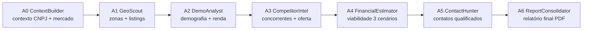

# GymSite Intelligence — Pipeline de Agentes

## Contexto da Stack

- **Framework:** Google ADK (Agent Development Kit) Python
- **Modelo:** Gemini (via `google-adk>=1.3.0`)
- **Orquestração:** `Runner` + `InMemorySessionService`
- **Callbacks:** `after_agent_callback` para persistência defensiva
- **Estado:** Session state (dict) passado entre agentes

## Pipeline de Relatórios (A0 → A6)



### Regras de Ouro

1. **Cada agente é puro** — não faz side-effects, apenas popula `session.state`
2. **Callbacks fazem persistência** — `after_agent_callback` grava no Supabase
3. **Fallback sem LLM** — se Gemini falhar, use heurística (ex: A3c sem LLM)
4. **Lazy imports** — `google.adk` importado DENTRO da função, não no topo

## Estrutura de um Agente

```python
from google.adk.agents import Agent
from google.adk.tools import Tool

def _a3_after_agent_callback(callback_context):
    """Callback pós-A3: persiste concorrentes no Supabase."""
    state = getattr(callback_context, "state", None) or {}
    if state.get("competidores"):
        from db.supabase_writer import upsert_competidores
        upsert_competidores(state["competidores"])

context_builder_agent = Agent(
    name="context_builder",
    model="gemini-2.0-flash",
    instruction="Você é um especialista em contexto de mercado fitness...",
    tools=[buscar_dados_cnpj, buscar_contexto_mercado],
    after_agent_callback=_a3_after_agent_callback,
)
```

## State Convention

Cada agente lê e escreve chaves específicas no `session.state`:

| Agente | Lê | Escreve |
|---|---|---|
| A0 | `cnpj`, `cidade` | `contexto_mercado`, `entrantes_cnpj` |
| A1 | `cidade`, `bairro` | `zonas_comerciais`, `listings` |
| A2 | `zonas_comerciais` | `demografia`, `renda_per_capita` |
| A3 | `contexto_mercado` | `competidores`, `oferta_concorrentes` |
| A4 | `area_m2`, `faixa_ticket` | `viabilidade_3_cenarios`, `payback_meses` |
| A5 | `competidores` | `contatos_qualificados` |
| A6 | `session.state` (tudo) | `relatorio_final`, `pdf_url` |

## Runner e Background Tasks

```python
from google.adk.runners import Runner
from google.adk.sessions import InMemorySessionService

session_service = InMemorySessionService()
session = session_service.create_session(
    app_name="gymsite_pipeline",
    user_id=relatorio_id,
    state={"cidade": cidade, "cnpj": cnpj},
)

runner = Runner(
    agent=root_agent,  # compositor A0→A6
    app_name="gymsite_pipeline",
    session_service=session_service,
)

async for event in runner.run_async(session=session):
    if event.is_final_response():
        callback(session.state)
```

## Anti-padrões

- ❌ Não acesse Supabase DENTRO do agente — use callbacks
- ❌ Não assuma que `session.state` tenha todas as chaves — use `.get()` com default
- ❌ Não rode agentes síncronos em requisições HTTP — use `BackgroundTasks`
- ❌ Não ignore eventos de erro do ADK — capture e logue

## Depuração

```python
# Ativar logs detalhados do ADK
import logging
logging.getLogger("google.adk").setLevel(logging.DEBUG)

# Inspecionar state após cada agente
print(json.dumps(session.state, indent=2, ensure_ascii=False, default=str))
```
