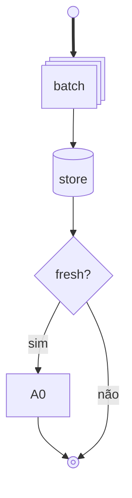

# Pretty Mermaid — especialista MermaidChart

Author `.mmd` ready for **MermaidChart: Preview Diagram**. Prefer semantic shapes (v11.3+). Optional render via `beautiful-mermaid` scripts when present.

## When invoked

1. Read source (`.py` / SPEC / rules) — never invent edges.
2. Pick diagram type (default `flowchart TB` + `elk` for complex).
3. **Dedupe first** — see [Deduplicate](#deduplicate-before-draw).
4. Write/update `.mmd` beside source (or `docs/arquitetura/`).
5. Tell user: open `.mmd` → `MermaidChart: Preview Diagram` (`Ctrl+Shift+P`). Do not open Preview yourself. Do not invent cloud sync (`/mermaid-cloud`).

## GymSite paths

| Artefato | Onde |
|---|---|
| Spec fluxo | `agents/specs/SPEC_*.mmd` |
| Tool 5 Whys | `tools/<nome>_5whys.mmd` |
| Auditoria | `.agent/rules/auditoria-*.mmd` |
| Comando | `.cursor/commands/mermaid.md` |

Config header padrão GymSite:

```yaml
---
config:
  layout: elk
  theme: mc
  flowchart:
    defaultRenderer: elk
---
```

## Deduplicate before draw

Kill these smells:

| Smell | Fix |
|---|---|
| Subgraph "Who consumes" mirroring agents already on edges | Drop subgraph; label consumer on node |
| Two load paths same sink (`inject` + `carregar` → A0) | One `lean-r` I/O node |
| Same criterion → two audit boxes | One `diam` then branch |
| Fake consumer (A0 → A6 "narrar") | Remove or `comment` shape |
| Cluster of `-.->\|nao usa\|` | One `comment` / `braces` note + `~~~` layout |
| Undefined node only as sink | Define or delete |
| Batch + report spine both thick | Primary `==>` ; secondary `-->` ; audit `-.-` |

**Lagom:** fewer nodes, clearer ranks. Extra edge that restates a label = delete.

## Semantic shapes (v11.3+) — use these

Syntax:

```mermaid
NodeId@{ shape: rect, label: "Process" }
```

| Meaning | shape | GymSite use |
|---|---|---|
| Start small | `sm-circ` | batch / job start |
| Stop | `fr-circ` / `dbl-circ` | Closed / terminal |
| Process | `rect` | agent step A0–A9 |
| Subprocess | `subproc` | save/upsert, helper |
| Multi-process | `procs` | batch script |
| Event | `rounded` / `event` | report start, webhook |
| Decision | `diam` | fresh? gap tipo? |
| Prepare / gate | `hex` | stale check, TTL |
| I/O | `lean-r` / `lean-l` | inject, tool load |
| DB | `cyl` | Supabase table / bundle store |
| Datastore | `datastore` | renda_bairro, cache |
| Disk / DAS | `das` / `lin-cyl` | place_id / FS cache |
| Docs | `docs` / `doc` | auditoria, SPEC |
| Tagged doc | `tag-doc` | gate / aceite |
| Delay / fallback | `delay` | Deep Research, wait |
| Com link | `bolt` | SearchAPI / external API |
| Terminal OK | `stadium` | skip DR, done path |
| Comment | `comment` / `braces` | non-edges, invariants |
| Manual | `trap-t` / `sl-rect` | ops / human |
| Priority | `trap-b` | Act-on crítico |

Full catalog + gotchas: [references/SHAPES.md](references/SHAPES.md).

### Gotchas (break render)

- Node text `end` lowercase → use `End` / `END`.
- Edge to id starting with `o` or `x` → space or capitalize (`A --- oB` bad → circular/cross).
- Prefer quotes for special chars: `id["text (parens)"]`.
- Subgraph `direction` ignored if node links outside subgraph — expect parent direction.
- Never put method names as Jinja keys in docs adjacent; N/A for pure `.mmd`.

## Edge grammar

| Edge | Meaning |
|---|---|
| `==>` | primary / hot spine |
| `-->` | normal dependency |
| `-.->` | optional / audit / soft |
| `--x` / `x--x` | forbidden / does not consume |
| `~~~` | invisible layout only |
| `e1@-->` + `e1@{ animation: fast }` | animate primary (sparingly) |

Labels: `A -->|sim| B` — short Portuguese OK on product diagrams.

## Diagram type picker

| Need | Type |
|---|---|
| Pipeline / batch / who-reads | `flowchart` |
| Call order | `sequenceDiagram` |
| Lifecycle audit states | `stateDiagram-v2` |
| Pydantic / classes | `classDiagram` |
| SQL tables | `erDiagram` |

## Creating / updating `.mmd`

1. List real producers, stores, consumers from code.
2. Rank: primary write→read, secondary parallel stores, tertiary degradation/audit.
3. Assign shapes from table above.
4. Dedupe pass.
5. Write file; keep under ~40 nodes when possible.
6. User previews in MermaidChart.

Example (shape style):



## Render (optional — beautiful-mermaid)

If skill dir has `scripts/render.mjs`:

```bash
node scripts/render.mjs --input diagram.mmd --output diagram.svg --format svg --theme tokyo-night
node scripts/render.mjs --input diagram.mmd --format ascii --use-ascii
node scripts/batch.mjs --input-dir ./diagrams --output-dir ./out --format svg --theme tokyo-night --workers 4
node scripts/themes.mjs
```

Themes dark docs: `tokyo-night`, `github-dark`, `dracula`. Light: `github-light`, `zinc-light`.

GymSite default day-to-day = **MermaidChart Preview** on `.mmd` (no SVG required). Render scripts only when user asks SVG/ASCII/batch.

## Workflow decision tree

1. User wants **author/update flow** → create `.mmd` with shapes + dedupe → Preview tip.
2. User wants **render SVG/ASCII** → scripts above (if installed).
3. User wants **theme compare** → batch themes loop.
4. User says **fluxo repetido** → run Deduplicate checklist, rewrite `.mmd`.

## Anti-patterns

- Walls of identical rectangles with no shape semantics.
- Duplicate "consumers" subgraph.
- Documenting non-consumption as three parallel dotted edges.
- Mixing cloud Mermaid sync into local `/mermaid`.
- Copying entire Mermaid docs into every reply — link `references/SHAPES.md`.

## Resources

- [references/SHAPES.md](references/SHAPES.md) — full shape list + warnings
- [references/RENDER.md](references/RENDER.md) — SVG/ASCII/themes (pretty-mermaid scripts)
- Project command: `.cursor/commands/mermaid.md`
