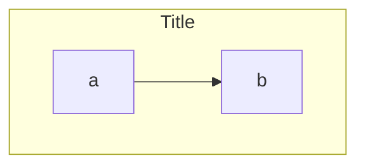

# Mermaid flowchart shapes (v11.3+)

Syntax: `Id@{ shape: NAME, label: "Text" }`

## Warnings

1. Node label `end` lowercase breaks parser → use `End` / `END`.
2. First letter `o` / `x` on connected node id can become circular/cross edge → space or capitalize.
3. Quote labels with special chars: `id["a (b)"]`.
4. Subgraph `direction` ignored when any node links outside — inherits parent.

## Shape catalog

| Semantic | Short | Aliases | Use |
|---|---|---|---|
| Bang | `bang` | | alert |
| Card | `notch-rect` | card, notched-rectangle | card / ticket |
| Cloud | `cloud` | | cloud / external SaaS |
| Collate | `hourglass` | collate | merge/collate |
| Com link | `bolt` | com-link, lightning-bolt | API / SearchAPI |
| Comment L | `brace` / `comment` | brace-l | invariant note |
| Comment R | `brace-r` | | |
| Comment both | `braces` | | |
| I/O lean right | `lean-r` | in-out, lean-right | input/load |
| I/O lean left | `lean-l` | lean-left, out-in | output |
| Datastore | `datastore` | data-store | DFD store |
| Database | `cyl` | cylinder, db | SQL / Supabase |
| Decision | `diam` | diamond, decision, question | branch |
| Delay | `delay` | half-rounded-rectangle | wait / DR |
| Direct access | `h-cyl` / `das` | horizontal-cylinder | DAS cache |
| Disk | `lin-cyl` | disk, lined-cylinder | disk |
| Display | `curv-trap` | curved-trapezoid, display | UI |
| Divided process | `div-rect` | div-proc, divided-process | split process |
| Document | `doc` | document | single doc |
| Event | `rounded` / `event` | | event |
| Extract | `tri` | extract, triangle | extract |
| Fork/Join | `fork` | join | parallel barrier |
| Internal storage | `win-pane` | internal-storage, window-pane | in-mem |
| Junction | `f-circ` | filled-circle, junction | join point |
| Lined document | `lin-doc` | lined-document | |
| Lined process | `lin-rect` | lin-proc, shaded-process | |
| Loop limit | `notch-pent` | loop-limit, notched-pentagon | |
| Manual file | `flip-tri` | flipped-triangle, manual-file | |
| Manual input | `sl-rect` | manual-input, sloped-rectangle | |
| Manual op | `trap-t` | inv-trapezoid, manual, trapezoid-top | ops |
| Multi-document | `docs` | documents, stacked-document | auditoria pack |
| Multi-process | `procs` / `st-rect` | processes, stacked-rectangle | batch |
| Odd | `odd` | | rare |
| Paper tape | `flag` | paper-tape | |
| Prepare | `hex` | hexagon, prepare | gate / stale |
| Priority | `trap-b` | priority, trapezoid-bottom | Act-on |
| Process | `rect` | proc, process, rectangle | default step |
| Start | `circle` / `circ` | | start |
| Start small | `sm-circ` | small-circle, start | compact start |
| Stop | `dbl-circ` | double-circle | stop |
| Stop framed | `fr-circ` | framed-circle, stop | Closed |
| Stored data | `bow-rect` | bow-tie-rectangle, stored-data | |
| Subprocess | `fr-rect` / `subproc` | framed-rectangle, subroutine | helper |
| Summary | `cross-circ` | crossed-circle, summary | |
| Tagged document | `tag-doc` | tagged-document | gate / SPEC tag |
| Tagged process | `tag-rect` | tag-proc, tagged-process | |
| Terminal | `stadium` | pill, terminal | success end |
| Text block | `text` | | annotation |

Legacy sugar still OK: `[(db)]`, `{decision}`, `([stadium])`, `[[sub]]` — prefer `@{ shape }` for new diagrams.

## Icon / image (optional)

```mermaid
flowchart TD
  U@{ icon: "fa:user", form: "square", label: "User", pos: "t", h: 60 }
  I@{ img: "https://mermaid.js.org/favicon.svg", label: "Logo", pos: "t", h: 60, constraint: "on" }
```

Requires icon pack registration / network — avoid in offline GymSite specs unless user asks.

## Edges quick ref

```
A --> B
A ==> B
A -.-> B
A --o B
A --x B
A o--o B
A <--> B
A ~~~ B
A e1@--> B
e1@{ animation: fast }
e1@{ curve: natural }
```

Longer rank: add dashes (`--->`, `---->`).

## Subgraphs



Link subgraphs by id: `one --> two`.
