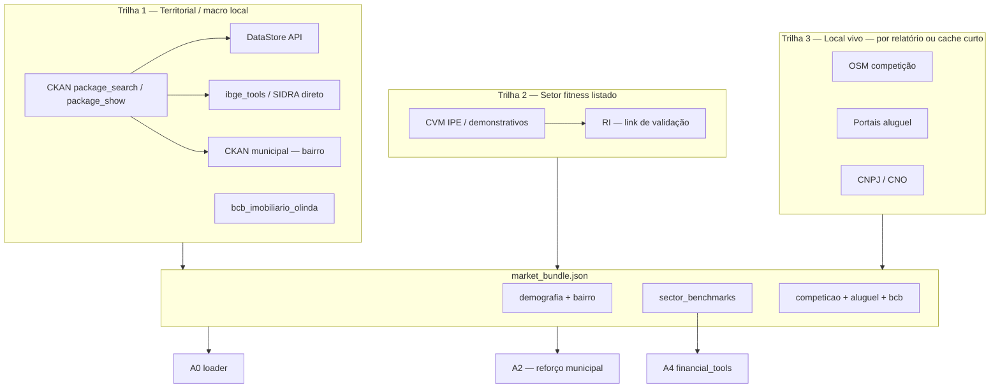

# Arquitetura de dados de mercado, latência e benchmarks — GymSite Intelligence

Documento **único** que integra:

- Diagnóstico de pipeline (tokens, tempo, custo)
- CKAN como **catálogo** vs fontes diretas (IBGE, CVM, BCB)
- Trilha **territorial** + trilha **setor listado** (Smart Fit / CVM)
- `market_bundle.json` e A0 como **loader** (não Deep Research de 20 min)
- VM Market Atlas, batch semanal (cron → Airflow depois)
- PRDs de **benchmarks dinâmicos** e **CAPEX dinâmico** alinhados ao código existente
- Plano de implementação por fases

Relacionado: [`MARKET_ATLAS_MASTER_PLAN.md`](./MARKET_ATLAS_MASTER_PLAN.md), [`GOVERNANCA_CUSTO.md`](./GOVERNANCA_CUSTO.md), [`QWEN_BAILIAN_RAG.md`](./QWEN_BAILIAN_RAG.md).

---

## 0. Status de implementação (auditado 2026-06-14)

Este documento foi escrito como **plano** (2026-06-02). Auditoria de código mostra que **Fase A está construída, Fase B parcial e partes da Fase C já existem** — o texto abaixo descreve a arquitetura-alvo; aqui o estado real.

| Componente | Estado | Evidência |
|------------|--------|-----------|
| `tools/ckan_client.py`, `tools/cvm_listed_metrics.py`, `tools/market_bundle.py`, `tools/sinapi_indices.py` | ✅ existe | módulos no repo |
| `scripts/batch/{discover_ckan_catalog,build_market_bundles,update_benchmark_snapshots,update_capex_indices}.py` | ✅ existe | batch completo |
| Bundles materializados | ✅ 14 em `data/market_bundles/*.json` | Fortaleza×7, Curitiba, Brasília, João Pessoa, Niterói… |
| Snapshots/cache | ✅ `metrics/cache/{benchmark_snapshots,capex_indices,sector_listed}.json` + `cvm/itr_*.zip` 2020–2026 | CVM real baixado |
| A0 loader + inject | ✅ `carregar_market_bundle` (A0), `inject_market_bundle_context` (`api.py`) | trilha feliz ligada |
| Hierarquia snapshot→grounding→fallback | ✅ `benchmarks_tool.py` | `_ler_snapshot_arquivo`→`_buscar_via_grounding`→`DEFAULTS_FALLBACK` |
| DAG Airflow + crontab | ✅ existe (era "Fase C/adiar") | `scripts/batch/dags/`, `cron/` |
| Franquias / legal_fees curados | ✅ pilot | `data/franchise_curated/`, `data/legal_fees_pilot/` |

### Dois canais de aquisição de métricas (verificado 2026-06-14)

Métricas entram por **dois canais ortogonais** — não confundir (são papéis diferentes):

| Canal | Fonte | Tool | Métricas | Consumidor | Estado |
|-------|-------|------|----------|------------|--------|
| **1 — Dados abertos** | CVM ITR / IBGE / CKAN | `cvm_listed_metrics`, `ibge_tools`, `ckan_client` | SMFT3 **financeiro** (`margem_ebitda_pct` 47.8, `divida_liquida_ebitda` 1.48); pop/renda | `_alertas_vs_sector_listed` (comparação vs rede listada) | financeiro ✅; operacional-listado (ARPU/churn/alunos) via RI overlay = **25%** (só `alunos_ativos`) |
| **2 — Benchmarking setorial** | ACAD/IHRSA/HFA via Search Grounding → fallback | `benchmarks_tool` | **operacional setor**: `ticket_por_modelo` (=ARPU), `churn_mensal_por_modelo`, `inadimplencia_por_modelo`, freq. semanal | `calcular_viabilidade_3_cenarios` (**INPUT do modelo A4**) | ✅ **~100%** (mid R$149, churn .07; sanos) |

**Correção de enquadramento:** o operacional que o **modelo de viabilidade usa** (ticket/churn por modelo) vem do **canal 2** e está completo/saneado. Os "25%" referem-se só ao **canal 1 / SMFT3-listado** (enriquecimento de comparação, secundário) — não é input do modelo. O alerta `sector_kpi_*` monitora o canal 1.

**Saúde do canal 2 (corrigido 2026-06-14):** snapshot estava expirado (11d > TTL 7d) → runtime caía no grounding de 2025-11; e `setorial` tinha ticket alucinado (premium R$1500). `update_benchmark_snapshots.py --force-grounding` refrescou: `gerado_em` 2026-06-14, tickets sanos. O guard `TICKET_SANITY_BANDS` capturou nova alucinação ao vivo (premium R$1375 → capado R$299,90) — guard validado, mantém. Cron de fato não roda sozinho ainda (refresh manual).

### Gaps reais (reclassificados — não são "plano por fazer", são lacunas de dado/refino)

1. **KPIs operacionais (RI) — agora MONITORADOS (2026-06-14).** CVM ITR só traz financeiro (`margem_ebitda_pct` 47.8 ✅, `divida_liquida_ebitda` ✅); ARPU/churn/alunos vivem no RI (doc proíbe scrape primário). Adicionado caminho de **curadoria #2**: `metrics/cache/sector_listed_ri_overlay.json` preenche nulos sem sobrescrever CVM. Hoje `alunos_ativos=5,2 mi` (1T26, fonte RI) → cobertura **25%**. `sector_kpi_coverage()`/`sector_kpi_alertas()` (cvm_listed_metrics) + alerta em `financial_tools._alertas_vs_sector_listed` + `sector_kpi_gaps` no bundle/build **expõem a lacuna (não silenciam)** e apontam a fonte pra fechar 100%. `arpu_brl`/`churn_pct`/`capex_por_unidade_brl` pendentes (não divulgados em release público — preencher do RI deck). Não bloqueia trilha feliz.
2. **Renda-bairro = curadoria pilot**, não DataStore dinâmico. `renda_media:4850, fonte: curadoria_pilot_referencia_ipece_simda` (só `data/bairro_renda_pilot/`). DoD #3 atendido por valor curado; fetch municipal automático = Fase B aberta.
3. **Competição/aluguel = trilha viva (RESOLVIDO 2026-06-14).** Antes: bundle batch nascia `stale:True` por `competicao_osm_ausente` (batch rodou sem chave Maps) → `inject` nunca dava `skip_deep_research` → **DR sempre rodava**. Fix: `compute_bundle_stale` deixou de contar competição/aluguel (são trilha 3, preenchidas no relatório por A3/enrichment); novo `live_trail_pending()` + `LIVE_TRAIL_FIELDS`; `inject_market_bundle_context` ignora missing de trilha-viva ao decidir `skip_deep_research`. 8 bundles destravaram. Regressão travada em `tools/test_fase_c.py`.
4. **4 bundles expirados — RESOLVIDO (2026-06-14).** altamira, anápolis, brasília, eusébio rebuildados com `refresh_enrichment=True`; agora `stale=False`, `competicao_local.status=ok` (chave Maps corrigida popula competição no batch), `live_trail_pending=[]`. Frota: **0/14 stale** (era 8). Os outros 8 seguem não-stale com competição resolvida live no relatório (rebuild opcional no batch semanal preenche no batch também).
5. **Slug com acento:** `bundle_path` usa bairro cru → `fortaleza_eusébio_CE.json`; lookup sem acento (`eusebio`) não casa. Normalizar slug (strip de acentos) = backlog pequeno.

---

## 1. Problema (confirmado em logs e código)

| Métrica | Faixa observada | Causa principal |
|---------|-----------------|-----------------|
| `tempo_execucao_segundos` | ~6–51 min | A0 Deep Research (até 20 min) + cadeia ADK A0→A9 + retries 429 |
| `tokens_in_total` | ~347k–2,1M | State inteiro reenviado a cada agente; markdown gigante do DR |
| `custo_total_brl` | ~R$ 2–8 | DR + várias passagens Pro/Flash |

O gargalo **não é só “buscar dado”** — é o LLM atuando como **processador de bruto** em vez de **narrador** sobre fatos já resolvidos.

Smoke de enrichment (`scripts/enrichment/production_run_metrics.json`): **~26 s**, **~442 tokens** — isso é `build_cache` (OSM + portais + BCB) + Flash-Lite em prompt comprimido. **Não** é o relatório completo.

---

## 2. Síntese executiva

| Motor | Papel | Tempo típico (miss vs hit) |
|-------|--------|----------------------------|
| **Deep Research (A0 hoje)** | Agente web + narrativa misturada | **5–20 min** a frio; **&lt;1 s** com cache em `market_context/*.md` |
| **CKAN Action API** | Descoberta de pacotes, metadados, licença, links | Batch: **segundos–minutos**; relatório: **0 s** com bundle |
| **IBGE / SIDRA (direto)** | Demografia **municipal** | **1–5 s** por consulta (`tools/ibge_tools.py`, agente **A2**) |
| **CVM / RI (listado)** | Benchmarks Smart Fit, Bluefit (SMFT3, BIOM3…) | Batch; **auditável** — trilha que estava “invisível” |
| **BCB Olinda** | Macro imobiliário | **1–3 s** (já em `build_cache`) |
| **CNPJ / OSM / portais** | Parque, concorrência, aluguel | **~30–45 s** no cache local |

**Conclusão:** CKAN **não substitui** IBGE nem CVM — **organiza o acesso**. Demografia “igual IBGE” via CKAN é só **metadado + link**; o fetch é na API oficial. Smart Fit / balanços são **segunda trilha** (CVM), não Solr.

**Meta de produto:** batch semanal na VM → `market_bundle.json` no GCS/disco → A0 = **loader** → DR só **fallback** → relatório **3–8 min** e **40k–120k tokens** (tier completo); tier light **1,5–3 min** se A3 enxuto.

---

## 3. Duas trilhas de dados abertos (não misturar)



### 3.1 Trilha territorial (CKAN + IBGE + municipal)

| Dado | Fonte ideal | Granularidade hoje no repo |
|------|-------------|---------------------------|
| População, faixa etária | IBGE Censo / agregados | Município (**A2**) |
| Renda | `RENDA_PER_CAPITA_MUNICIPIO` + fallback UF | Município; **bairro** vazio no A0 |
| Renda / pop **bairro** | IPECE, SIMDA, secretarias via **portal CKAN da cidade** | Não implementado |
| Macro imobiliário | BCB Olinda | Cidade/região |
| Regulamentação | Legislação municipal indexada no CKAN | Narrativa; batch |

**Lacuna crítica:** A0 exige `renda_media_bairro`; DR costuma **não entregar** (ex.: Parangaba — texto longo, renda “não disponível nos snippets”). CKAN municipal + DataStore fecha isso **no batch**, não no clique.

### 3.2 Trilha setor listado (CVM / Smart Fit — “invisível” antes)

Fontes públicas (não são “API CKAN”, mas o **catálogo** dados.gov pode apontar para elas):

| Fonte | Conteúdo | Uso GymSite |
|-------|----------|-------------|
| CVM / IPE | ITR, DRE, balanço, KPIs operacionais | `sector_benchmarks`: ARPU, churn, EBITDA, capex/unidade |
| RI Smart Fit | Apresentações, KPIs | Validação cruzada; **não** scrape primário |
| B3 | Comunicados | Contexto mercado |

KPIs → calibrar `tools/financial_tools.py` e alertas A4/A6 (“payback vs rede listada”), **não** substituir due diligence do ponto.

### 3.3 Trilha local viva (já parcial no cache)

`scripts/enrichment/cache_enrichment.py` hoje: OSM, portais aluguel, BCB. **Falta:** demografia, CNPJ, CKAN, CVM no bundle.

---

## 4. CKAN API v2.10 / v3 — o que usar no GymSite

Modelo **RPC**: `POST /api/3/action/<nome>` → `{ "success", "result", "error" }`.

| Action | Uso |
|--------|-----|
| `package_search` | Descobrir datasets (`q`, `fq`, facetas; máx. ~1000 rows/página) |
| `package_show` | Metadados + **resources** (URL, format, hash) |
| `resource_search` | Achar CSV/API por campo |
| `status_show` | Health do portal antes do batch |

**Importante:**

- **DataStore ≠ Action API** — tabelas grandes: cliente DataStore (`datastore_search`) ou dump.
- `package` = `dataset` (sinônimos internos).
- Leitura pública em `dados.gov.br` em geral **sem token**.
- Instâncias: **federal** (dados.gov) + **municipal** (Fortaleza, SP…) — descoberta **por cidade** no batch.

CKAN entrega **catálogo e metadados**; o ETL **resolve** cada `resource` → IBGE, SIDRA, CSV, CVM, PDF.

---

## 5. Deep Research vs bundle (tempos)

| Situação A0 | Tempo |
|-------------|-------|
| Cache disco `market_context/*.md` (7d) | &lt;1 s |
| LangCache semântico | ~200 ms |
| Deep Research a frio (`DEEP_RESEARCH_TIMEOUT_SEC=1200`) | **5–20 min** |
| `build_cache` (OSM + portais + BCB) | **~25–45 s** |
| Batch CKAN + IBGE + CVM + municipal | **minutos/semana**; relatório **0 s** se bundle pronto |

DR mistura as trilhas em markdown → **1M+ tokens** downstream. Bundle separa blocos com `fonte` e `data_coleta`.

---

## 6. `market_bundle.json` (v1)

Artefato por `(cidade, bairro, uf)` — GCS ou `data/market_bundles/{slug}.json` na VM.

```json
{
  "version": "1.0",
  "local": { "cidade": "", "bairro": "", "uf": "", "codigo_ibge_municipio": "" },
  "gerado_em": "ISO8601",
  "valido_ate": "ISO8601",
  "ckan_catalog": {
    "portais_consultados": ["https://dados.gov.br", "..."],
    "datasets_matched": [{ "id": "", "name": "", "organization": "", "portal": "" }]
  },
  "demografia": {
    "municipio": {
      "populacao_total": 0,
      "renda_media_domiciliar": 0,
      "renda_granularidade": "municipal",
      "fonte": "IBGE Censo 2022 / ibge_tools"
    },
    "bairro": {
      "populacao": null,
      "renda_media": null,
      "granularidade": "bairro",
      "fonte": "IPECE|SIMDA|datastore",
      "dataset_id": ""
    }
  },
  "sector_benchmarks": {
    "empresas": [
      {
        "nome": "Smart Fit",
        "ticker": "SMFT3",
        "periodo_ref": "2024T3",
        "fonte": "CVM IPE",
        "kpis": {
          "alunos_ativos": null,
          "churn_pct": null,
          "arpu_brl": null,
          "margem_ebitda_pct": null,
          "capex_por_unidade_brl": null,
          "divida_liquida_ebitda": null
        },
        "notas": "Preferir EBITDA ajustado divulgado (IFRS 16)"
      }
    ]
  },
  "competicao_local": {},
  "aluguel_portais": {},
  "bcb_imobiliario": {},
  "capex_indices": {
    "uf": "CE",
    "obra_adaptacao_por_m2": null,
    "equipamentos_por_m2": null,
    "fonte_obra": "SINAPI|benchmark_fixo",
    "reference_month": "YYYY-MM"
  },
  "prompt_resumo_md": "",
  "missing_fields": [],
  "stale": false
}
```

### 6.1 A0 como loader

| Variável / flag | Comportamento |
|-----------------|---------------|
| `A0_CONTEXT_SOURCE=ckan_bundle` (default alvo) | `carregar_market_bundle(cidade, bairro, uf)` → preenche `market_context` |
| `A0_CONTEXT_SOURCE=deep_research_fallback` | DR/Kimi só se campo obrigatório em `missing_fields` |
| CNPJ + OSM | Mantém tools atuais; números **não** vêm do DR |

Proibido copiar `principais_redes_concorrentes` do DR — regra já no `a0_context_builder.py` (somente OSM).

---

## 7. Infraestrutura: VM, cache, batch

Alinhado ao [Market Atlas F0](MARKET_ATLAS_MASTER_PLAN.md):

| Fase | O quê | Efeito |
|------|--------|--------|
| **F0** | VM GCE: Redis, Playwright, volumes, API 24/7 | Confiabilidade; **não** corta 85% do tempo sozinho |
| **F1** | Ampliar `build_cache` + `market_waves.csv` pre-warm | Menos falha OSM/portais no clique |
| **F2** | Batch semanal: `discover_ckan` + `build_market_bundles` + CVM snapshots | A0 deixa de ser pesquisador |
| **F3** | Pipeline enxuto: A4/A6 determinísticos + narrativa compacta | Meta tokens/tempo |

**Agendamento (decidido 2026-06-14): GitHub Actions + Supabase, custo US$0** — supera o cron de VM (que custaria ~US$6-8/mês 24/7 p/ job semanal). Supabase tem `pg_cron`/`pg_net` mas **não roda Python** (só agenda/dispara); então compute = GitHub Actions (free tier), storage = Supabase.

- **Compute:** `.github/workflows/weekly-market-batch.yml` (cron `0 6 * * 0`, ~03:00 BRT + `workflow_dispatch`) roda `run_weekly_market_batch.py` com `--skip-enrichment` (sem Playwright no CI; competição/aluguel são trilha viva, resolvidas no relatório).
- **Storage:** tabelas `public.market_bundles` + `public.market_snapshots` (JSONB, migração `db/migrations/20260614_market_store.sql`). `tools/market_store.py` (thin, guarded) + `market_bundle.py`/`benchmarks_tool.py` leem Supabase-first, fallback FS. Opt-in por env `MARKET_BUNDLE_SUPABASE=1`.
- **pg_cron:** job `market_bundles_mark_expired` (`0 4 * * *`) marca expirado via SQL — rede de segurança caso o batch atrase.
- **Dois lugares precisam da flag+creds:** (a) GitHub Actions (escreve — 6 secrets), (b) env da API Cloud Run (lê — `MARKET_BUNDLE_SUPABASE=1`; SUPABASE_URL/service key a API já tem).

VM/Airflow ficam como opção futura se a equipe migrar pra Composer; mesma função Python.

```
VM (southamerica-east1)
  cron semanal → scripts/batch/update_benchmark_snapshots.py
              → scripts/batch/build_market_bundles.py
              → scripts/batch/update_capex_indices.py (opcional)
  GCS ou data/market_bundles/
  API → inject bundle antes do ADK (como enrichment_cache hoje)
```

---

## 8. PRDs de benchmarks e CAPEX — integração ao código real

### 8.1 O que os PRDs pedem vs o que existe

| PRD | Propõe | Repo hoje |
|-----|--------|-----------|
| Pipeline fetchers/processors/repository | ETL benchmarks | **Não existe** pasta `fetchers/` |
| `viability_calculator.py` | Consumir repo | **`tools/financial_tools.py`** (`calcular_viabilidade_3_cenarios`) |
| Benchmarks dinâmicos | CVM, franquias, CKAN | **`tools/benchmarks_tool.py`** — Gemini Search Grounding + cache JSON + fallback ACAD |
| CAPEX 3 blocos | equip / obra / legal | **`_calcular_capex_detalhado`** + `CAPEX_DETALHADO_BASE` R$/m² + frete **ANTT** |
| Airflow semanal | DAG | **Adiar**; usar `scripts/batch/` + cron |

### 8.2 Hierarquia única de fontes (obrigatória)

Evita conflito entre scrape, CVM, grounding e hardcode:

1. **Estruturado** — CVM IPE, DataStore CKAN, IBGE API, BCB Olinda, SINAPI snapshot  
2. **Curadoria** — `metrics/cache/*.json` versionado no git ou Supabase  
3. **Search Grounding** — `obter_benchmarks_setoriais()` só para lacunas (panorama ACAD)  
4. **Hardcode ACAD** — `DEFAULTS_FALLBACK` / `CAPEX_DETALHADO_BASE`  

Pipeline **nunca falha** por fetch; marca `stale: true` e alerta no A6.

### 8.3 PRD 1 — Benchmarks de mercado (fetchers)

| Módulo | Decisão |
|--------|---------|
| `b3_financials` / CVM | **Implementar** `tools/cvm_listed_metrics.py` (SMFT3, BIOM3); evitar scrape RI como primário |
| `franchise_data` | **Fase C** — CSV curado; scrape frágil (ToS, layout) |
| `macro_data` | Reutilizar **`ibge_tools`**; CKAN só descoberta (`tools/ckan_client.py`) |
| `benchmark_engine` | `scripts/batch/update_benchmark_snapshots.py` → shape igual `DEFAULTS_FALLBACK` + KPIs CVM |
| `benchmark_repo` | Supabase `market_benchmark_snapshots` (JSONB) ou `metrics/cache/` |

Integração A4: `calcular_viabilidade_3_cenarios` já chama `obter_benchmarks_setoriais()` — passar a ler **snapshot** primeiro.

### 8.4 PRD 2 — CAPEX dinâmico

Já destrinchado no relatório:

- equipamentos, obra_adaptacao, projeto_arquitetonico, alvara_e_taxas, frete_equipamentos, contingencia  

| Fetcher PRD | Decisão v1 |
|-------------|------------|
| `equipment_prices` (licitações + catálogos) | **Adiar** — ruído alto; manter R$/m² + `equipamentos_override` |
| `construction_costs` (SINAPI) | **Fase B** — snapshot mensal por UF → atualiza só `obra_adaptacao_por_m2`. **Não** usar `agregados/6579` + `N6[código UF]` (UF ≠ município N6; SINAPI oficial é Caixa/SIDRA com tabela própria). Implementar em `scripts/batch/update_capex_indices.py`, não no hot path do relatório. |
| `legal_fees` (CAU/municipal) | **Fase C** — pesquisa por cidade |

Não rodar SINAPI/CVM no hot path do relatório (26s smoke); só no batch.

---

## 9. Estrutura de código alvo

```
tools/
  ckan_client.py              # package_search, package_show (v3)
  ckan_datastore.py           # datastore_search (opcional)
  cvm_listed_metrics.py       # SMFT3, BIOM3
  ibge_tools.py               # existente — não duplicar
  benchmarks_tool.py          # existente — consumir snapshot antes do grounding
  financial_tools.py          # existente — CAPEX lê capex_indices do bundle/cache
  enrichment_cache.py         # existente — injetar bundle no api.py

scripts/batch/
  discover_ckan_catalog.py    # por cidade/UF
  build_market_bundles.py     # compõe market_bundle.json
  update_benchmark_snapshots.py
  update_capex_indices.py     # SINAPI UF (fase B)

data/market_bundles/          # ou GCS gs://.../market_bundles/
metrics/cache/
  benchmarks_setoriais.json
  capex_indices_{uf}.json

supabase/migrations/
  YYYYMMDD_market_benchmark_snapshots.sql   # opcional
```

---

## 10. Plano de implementação

### Fase A — Alto ROI (1–2 semanas) ✅ CONSTRUÍDA

- [x] `tools/ckan_client.py` + `discover_ckan_catalog.py`
- [x] `tools/cvm_listed_metrics.py` + fixtures de teste
- [x] `scripts/batch/update_benchmark_snapshots.py`
- [x] `benchmarks_tool`: snapshot → grounding → fallback
- [x] `scripts/batch/build_market_bundles.py` (IBGE + cache local + CVM + catalog)
- [x] `api.py`: injetar bundle (`inject_market_bundle_context`, flag `A0_CONTEXT_SOURCE`)
- [x] `agents/a0`: tool `carregar_market_bundle` + DR fallback
- [x] Testes sem rede (`tools/test_fase_c.py`)

### Fase B — Bairro + CAPEX obra (parcial)

- [~] DataStore municipal → `demografia.bairro`: **curadoria pilot** (`data/bairro_renda_pilot/`), fetch dinâmico pendente
- [x] SINAPI por UF → `capex_indices` + `fonte_obra` em `_calcular_capex_detalhado` (`tools/sinapi_indices.py`, tabela 2296)

### Fase C — Opcional (parcial)

- [x] Franquias curadas (`data/franchise_curated/`) / scrape experimental pendente
- [x] `legal_fees` municipal (pilot — `data/legal_fees_pilot/`)
- [x] DAG Airflow espelhando cron VM (`scripts/batch/dags/gym_market_weekly_dag.py`)
- [~] Golden eval sem DR: `scripts/batch/golden_bundle_a0_gate.py` existe; cobertura a ampliar
- [ ] KPIs operacionais CVM (ARPU/churn/alunos) — exige RI parsing (gap #1)

### Definition of Done (produto)

1. Relatório Meireles/Parangaba com bundle &lt; 7 dias: A0 **sem** DR na trilha feliz.  
2. `sector_benchmarks.SMFT3` com `fonte: CVM IPE` e período no JSON.  
3. `renda_granularidade` = `bairro` quando pacote municipal existir.  
4. A4 alerta payback vs benchmark listado quando snapshot disponível.  
5. Falha CVM/CKAN: relatório completa com `stale: true`.  

---

## 11. Metas de latência e custo (realistas)

| Métrica | Hoje (full ADK) | Alvo pós F2/F3 |
|---------|-----------------|----------------|
| Tempo | 10–51 min | **3–8 min** (completo); **1,5–3 min** (light) |
| tokens_in | 1–2M | **40k–120k** |
| custo LLM | R$ 4–8 | **R$ 0,40–1,20** (ordem de grandeza; validar em wave) |

ROI smoke (`roi_validator`): ≤150 s / ≤R$1,30 / ≤150k tokens aplica ao **modo enriquecido**, não ao relatório A0–A9 completo.

---

## 12. O que o Deep Research ainda faz (fallback)

- Notícia local, tendência qualitativa sem dataset  
- Município sem pacote CKAN/bairro  
- `insights_estrategicos` quando bundle vazio  

Não usar DR para: população Censo, renda municipal, KPI SMFT3, aluguel mediano (portais), redes no raio (OSM).

---

## 13. Referências no repositório

| Arquivo | Papel |
|---------|--------|
| `tools/deep_research_tool.py` | A0 DR/Kimi, timeout 1200s, cache 7d |
| `tools/ibge_tools.py` | A2 municipal; `renda_granularidade` |
| `tools/financial_tools.py` | CAPEX, viabilidade 3 cenários |
| `tools/benchmarks_tool.py` | Grounding + fallback ACAD |
| `scripts/enrichment/cache_enrichment.py` | OSM, aluguel, BCB |
| `tools/enrichment_cache.py` | Hook API |
| `agents/a0_context_builder.py` | DR + CNPJ + OSM |
| `docs/reference/chat-export-1780439081874.json` | Pesquisa CKAN + Smart Fit (Qwen) |

---

## 14. Resumo em uma frase

**CKAN descobre, IBGE/CVM/DataStore entregam números auditáveis, batch semanal grava `market_bundle`, A0 carrega fatos em segundos; Deep Research vira exceção; benchmarks e CAPEX seguem hierarquia estruturada → curadoria → grounding → hardcode, integrados em `financial_tools` e não em um segundo calculador paralelo.**

---

*Última atualização: 2026-06-14 — auditoria de implementação (seção 0) + fix de classificação trilha-viva (`compute_bundle_stale`/`inject_market_bundle_context`). Original 2026-06-02: arquitetura discutida em sessão Cursor + PRDs benchmarks/CAPEX.*
