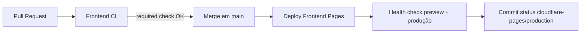

# Cloudflare Pages — Frontend GymSite

Produção: **https://gymsite.vectracargo.com.br**  
Projeto Pages: **gymsite-3p0**  
Preview: **https://gymsite-3p0.pages.dev**

## Fluxo commit → merge → deploy



| Etapa | Workflow | Quando roda |
|-------|----------|-------------|
| Validação | `.github/workflows/frontend-ci.yml` | PR que toca `frontend/**` |
| Deploy | `.github/workflows/pages.yml` | Push em `main` + `workflow_dispatch` |

`concurrency` com `cancel-in-progress: true` em ambos evita fila de runs antigos (checks amarelos acumulados).

## Secrets no GitHub (Settings → Secrets → Actions)

| Secret | Uso |
|--------|-----|
| `CLOUDFLARE_API_TOKEN` | Deploy via Wrangler (permissão **Cloudflare Pages Edit**) |
| `CLOUDFLARE_ACCOUNT_ID` | ID da conta Cloudflare |
| `VITE_SUPABASE_URL` | Build de produção |
| `VITE_SUPABASE_ANON_KEY` | Build de produção |
| `SLACK_WEBHOOK_URL` | (opcional) alerta de falha de deploy |

### Criar API token Cloudflare

1. [Dashboard](https://dash.cloudflare.com/profile/api-tokens) → Create Token  
2. Template **Edit Cloudflare Workers** ou custom: Account → **Cloudflare Pages → Edit**  
3. Salvar em `CLOUDFLARE_API_TOKEN`

## Regra de branch protection (obrigatório para não acumular status)

**Settings → Branches → Add rule → `main`:**

- [x] Require a pull request before merging  
- [x] Require status checks to pass before merging  
  - Marcar: **`Build & Lint`** (workflow *Frontend CI*)  
- [x] Require branches to be up to date before merging  
- [x] Do not allow bypassing the above settings  

Não exija o check de deploy no PR — ele só roda **após** o merge em `main`.

Opcional: **Settings → Actions → General → Workflow permissions** → Read and write (para commit status `cloudflare-pages/production`).

## Deploy manual

```bash
# GitHub Actions
gh workflow run "Deploy Frontend (Cloudflare Pages)"

# Local (com wrangler logado)
cd frontend
npm ci && npm run build
npx wrangler pages deploy dist --project-name=gymsite-3p0
```

## Domínio customizado (Cloudflare Dashboard)

Pages → **gymsite-3p0** → Custom domains → `gymsite.vectracargo.com.br`  
SPA: `frontend/public/_redirects` → `/* /index.html 200`

## Monitoramento pós-deploy

O workflow `pages.yml`:

1. Valida secrets antes do build  
2. Faz health check em preview **e** produção (5 tentativas, 8s intervalo)  
3. Publica commit status `cloudflare-pages/production` (sucesso/falha)  
4. Falha o job se qualquer URL não retornar 200/304  

Ver status no commit: **Checks** → `cloudflare-pages/production`.

## Primeiro deploy após configurar secrets

1. Confirmar secrets no repositório  
2. O workflow cria o projeto **gymsite-3p0** automaticamente se não existir (`pages project create`).  
3. Domínio customizado (uma vez):  
   ```powershell
   $env:CLOUDFLARE_API_TOKEN = "..."
   .\scripts\setup-cloudflare-pages-domain.ps1
   ```  
4. `git push origin main` (com mudanças em `frontend/`) ou `gh workflow run "Deploy Frontend (Cloudflare Pages)"`  
5. Abrir Actions → run verde → testar https://gymsite.vectracargo.com.br

### Erro `Project not found` (code 8000007)

O projeto Pages ainda não existe na conta. Rode o deploy de novo após o push do workflow atualizado (passo *Create Pages project if missing*) ou crie manualmente no dashboard: **Workers & Pages → Create → Pages → gymsite-3p0**.
