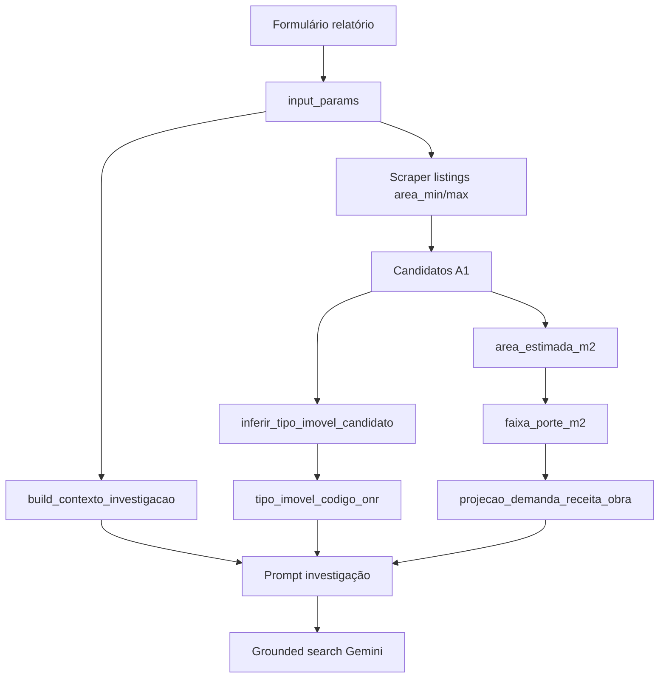

# Investigação de imóveis potenciais (A1)

Gatilho web: “o que está em funcionamento neste endereço hoje?” — complementa listings e âncoras Places, **sem** analytics ONR nem API de cartório.

**Código:** `tools/deep_research_tool.py`, `tools/investigacao_context.py`, hook em `tools/anchoring_tools.analisar_pontos_comerciais_completo`.

**Manual ONR (referência externa):** [Integração API Indicador Real](https://www.registrodeimoveis.org.br/integracao-api-indicador-real) · OpenAPI: `https://www.registrodeimoveis.org.br/swagger/openapi.json`

**PRD do módulo (CNJ + portais):** [PRD-ENRIQUECIMENTO-IMOVEIS.md](./PRD-ENRIQUECIMENTO-IMOVEIS.md)

---

## 1. `tipo_imovel_codigo_onr`

### O que é

Código inteiro do campo **`tipoImovel`** na API **Indicador Real** do Registro de Imóveis / ONR. Classifica o imóvel no cadastro registral (matrícula), não o negócio que opera no local.

O GymSite **não consulta** essa API na investigação. Usamos a tabela ONR como **vocabulário comum** e inferimos o código a partir do título do listing ou do tipo Places.

### Tabela completa (ONR)

| `tipo_imovel_codigo_onr` | Label ONR | Uso típico em prospecção academia |
|--------------------------|-----------|----------------------------------|
| **31** | **Galpão** | **Principal** — pé-direito, vão livre, depósito adaptado |
| **33** | Prédio Comercial | Edifício / bloco inteiro |
| **15** | Loja | Ponto de rua, shopping |
| **17** | Sala | Sala em edifício corporativo |
| **71** | Terreno/Fração | Lote para obra (cruzar com CNO) |
| 64 | Casa | Raro para academia |
| 65 | Apto | Raro |
| 35 | Prédio Residencial | Raro |
| 69 | Fazenda/Sítio/Chácara | Fora do escopo urbano |
| 89 | Outros | Fallback |

Constante em código: `tools/investigacao_context.TIPOS_IMOVEL_ONR`.

### Prioridade GymSite (academia tradicional)

Ordem usada no prompt e no scraper de listings:

1. **31 — Galpão**
2. **33 — Prédio Comercial**
3. **15 — Loja**
4. **17 — Sala**

`TIPOS_IMOVEL_ALVO_ACADEMIA` em `investigacao_context.py`.

### Inferência por candidato (listings / Places)

Função: `inferir_tipo_imovel_candidato(candidato)` → objeto gravado em **`candidato.tipo_imovel_inferido`**:

```json
{
  "tipo_imovel_label": "Galpão",
  "tipo_imovel_codigo_onr": 31,
  "inferido_de": "titulo_ou_tipos"
}
```

| `inferido_de` | Significado |
|---------------|-------------|
| `titulo_ou_tipos` | Regex no nome/motivo/tipos (ex.: “galpão”, “ponto comercial”) |
| `listing_sem_keyword` | Listing sem palavra-chave reconhecida |
| `places_ancora` | Candidato âncora Google (supermercado, loja fechada, etc.) |

Palavras-chave → código (resumo):

| Padrão no título | Código |
|------------------|--------|
| galpão, depósito, armazém | **31** |
| prédio, edifício inteiro | **33** |
| loja, ponto comercial, box | **15** |
| sala comercial | **17** |
| terreno, lote | **71** |

**Limitação:** OLX/ImovelWeb não enviam `tipoImovel` ONR; o código é **heurístico**. Validar em vistoria.

### Onde aparece no pipeline

| Etapa | Campo |
|-------|--------|
| A1 candidato | `tipo_imovel_inferido` |
| Prompt investigação | Bloco “Candidato atual — tipo inferido (código ONR …)” |
| JSON investigação | Opcional em `investigacao_resultado.resultado` |
| A6 / relatório | Pode ser exposto via `investigacao_site` (futuro: linha explícita no markdown) |

---

## 2. Tamanho (área e porte)

Três camadas de “tamanho” — não confundir:

```
input_params (formulário)  →  faixa de BUSCA de anúncios
tamanho_preset (kit)       →  referência de NEGÓCIO do investidor
área do candidato (m²)     →  porte CNO + projeção matrículas/receita
```

### 2.1 Faixa de busca — `area_m2_min` / `area_m2_max`

Origem: formulário do relatório → `api.py` → `tool_context.state.input_params`.

| Campo | Exemplo Meireles | Uso |
|-------|------------------|-----|
| `area_m2_min` | 800 | Filtro scraper OLX/ImovelWeb |
| `area_m2_max` | 1500 | Idem |

Implementação: `anchoring_tools._fetch_listings_como_candidatos` lê `input_params` e chama `fetch_commercial_listings_async(cidade, uf, area_min, area_max)`.

**Não** é campo da API ONR; é critério do investidor.

### 2.2 Preset de unidade — `tamanho_preset`

| Preset | Área ref. kit (m²) | Modelo (academia) | Faixa ticket A4/CNO |
|--------|-------------------|-------------------|---------------------|
| `pp` | 300 | Smart Fit Express | `low` |
| `p` | 600 | Selfit P | `low` |
| **`m`** | **1000** | Smart Fit Standard | **`mid`** |
| `g` | 2000 | Bodytech entry | `premium` |
| `gg` | 4000 | Bodytech flagship | `premium` |

Fonte kits: `frontend/src/data/kits/academia.ts`  
Mapeamento código: `PRESET_AREA_REF_M2`, `PRESET_PARA_FAIXA_TICKET` em `investigacao_context.py`.

O preset define **o tamanho da academia que o investidor quer abrir**, não o tamanho do imóvel anunciado (que pode estar na faixa min/max).

### 2.3 Porte por área — `faixa_porte_m2` (mesmo CNO)

Função compartilhada: `cno_fitness_tools._faixa_porte_m2(area)` — usada em obras CNO e na investigação.

| Área (m²) | `faixa_porte_m2` |
|-----------|------------------|
| &lt; 600 | `pequena` |
| 600 – 1.499 | `media` |
| ≥ 1.500 | `grande` |

Plausibilidade obra fitness CNO: entre **80** e **8.000** m² (`_AREA_MIN_M2` / `_AREA_MAX_M2` em `cno_fitness_tools.py`).

### 2.4 Projeção operacional (cross-process CNO / A4)

Quando o candidato tem área (`area_estimada_m2` do listing ou futuro CNO match), o prompt inclui **benchmark** via `projecao_demanda_receita_obra(area_m2, faixa_ticket)` (`financial_tools.py`):

- `matriculas.realista` = `area_m2 × matr_por_m2` (por faixa low/mid/premium)
- `receita_mensal_estimada.realista` = matrículas × ticket × (1 − inadimplência)

**Importante:** isso estima o **potencial se uma academia do preset ocupar aquele m²**, não o faturamento do lojista atual no endereço.

| Origem área | Campo candidato |
|-------------|----------------|
| Listing | `area_estimada_m2` |
| CNO (entrante com match) | `area_m2_obra` (A0/A6) |
| ONR API (futuro) | `area` no payload Indicador Real |

### 2.5 Tamanho na API ONR (referência)

No schema OpenAPI (`indicadorRealRequest`):

- Campo **`area`**: área em m² (privativa ou lote, conforme tipo de imóvel).
- **Não existe** parâmetro de listagem pública “galpões entre 800 e 1500 m²” para terceiros; cartórios **enviam** registros, não abrem consulta agregada de mercado para o GymSite.

---

## 3. Contexto injetado no prompt

`build_contexto_investigacao(input_params)` monta:

```json
{
  "cidade": "Fortaleza",
  "bairro": "Meireles",
  "uf": "CE",
  "tipo_negocio": "academia",
  "tamanho_preset": "m",
  "area_m2_min": 800,
  "area_m2_max": 1500,
  "area_referencia_preset_m2": 1000,
  "faixa_porte_preset": "media",
  "faixa_ticket": "mid",
  "tipos_imovel_onr_prioritarios": [...],
  "projecao_preset_referencia": { "matriculas": {...}, "receita_mensal_estimada": {...} }
}
```

`formatar_bloco_contexto_prompt(contexto, candidato)` gera o markdown lido pelo Gemini na investigação.

---

## 4. Gatilhos e limites

| Regra | Condição |
|-------|----------|
| P1 | `qualidade_sinal=direto-listing` + endereço + `listing_url` |
| P2 | Places `CLOSED_TEMPORARILY` / `CLOSED_PERMANENTLY` |
| P3 | `motivo` contém “investigar” e `score_geoscout` ≥ 7 |
| P4 | Listing + palavra comercial no título |

Env:

| Variável | Default |
|----------|---------|
| `INVESTIGACAO_MAX_POR_RELATORIO` | 5 |
| `INVESTIGACAO_TIMEOUT_SEC` | 180 |
| `INVESTIGACAO_CACHE_TTL_DIAS` | 3 |
| `INVESTIGACAO_DISABLED` | false |

Cache: `market_context/investigations/{id}.md`

---

## 5. Saída da investigação

JSON no final da resposta do modelo:

```json
{
  "status_operacao": "em_funcionamento|fechado|reforma|vago|incerto",
  "operador_atual": "string|null",
  "segmento": "academia|varejo|restaurante|servicos|vazio|outro",
  "confianca": "alta|media|baixa",
  "coerencia_listing": "sim|nao|incerto|na",
  "evidencias": [{"fonte": "...", "url": "https://...", "trecho": "..."}],
  "implicacao_site": "frase acionável"
}
```

Persistência no candidato: `investigacao_resultado` · resumo A6: `investigacao_site`.

---

## 6. Diagrama resumido



---

## 7. Testes

```powershell
python -m tools.test_investigacao_gatilhos
```

Cobre gatilhos, contexto Meireles 800–1500, inferência galpão → código **31**.
