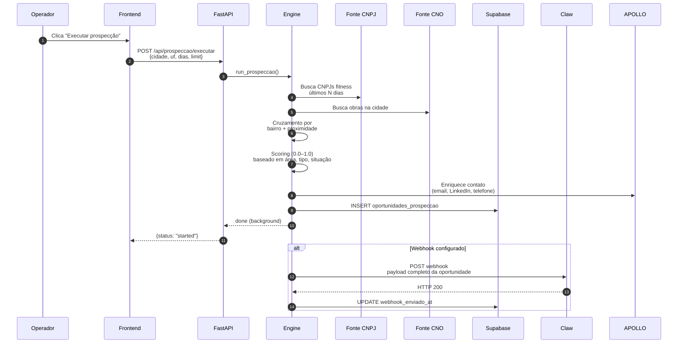
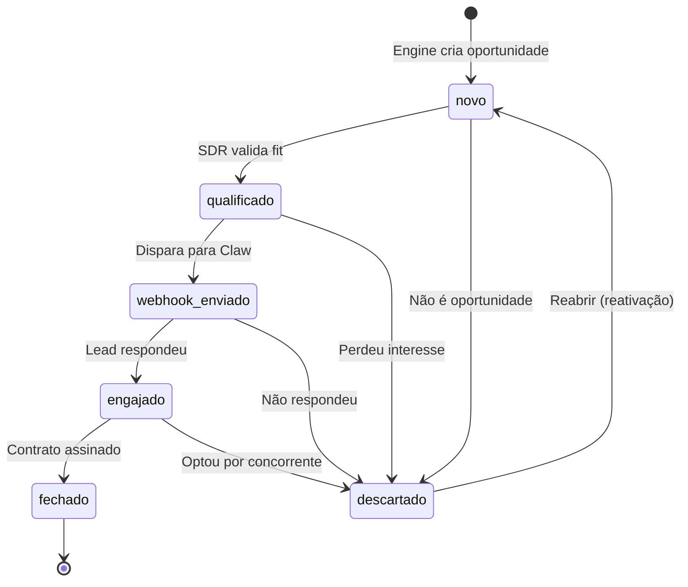
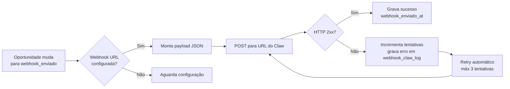
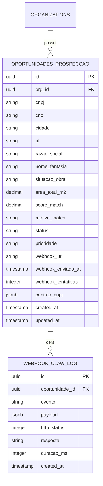
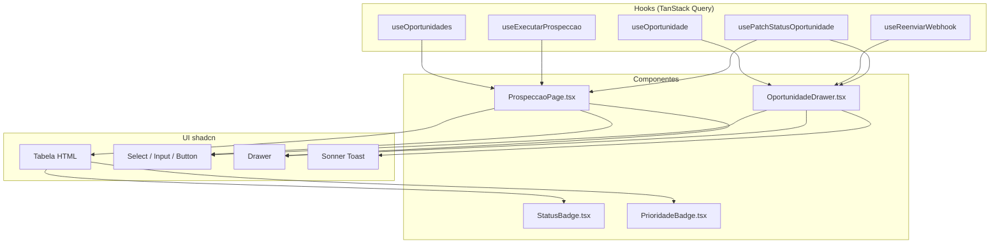
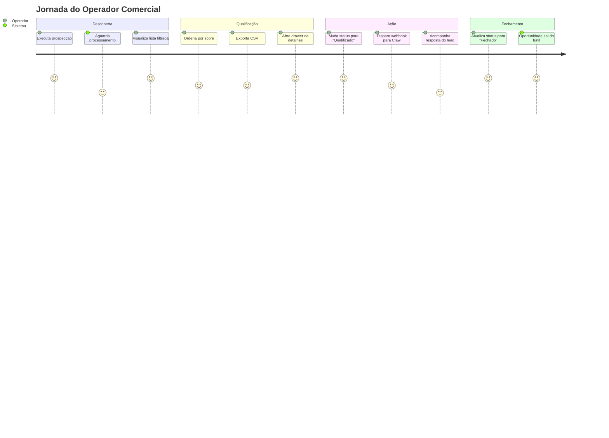
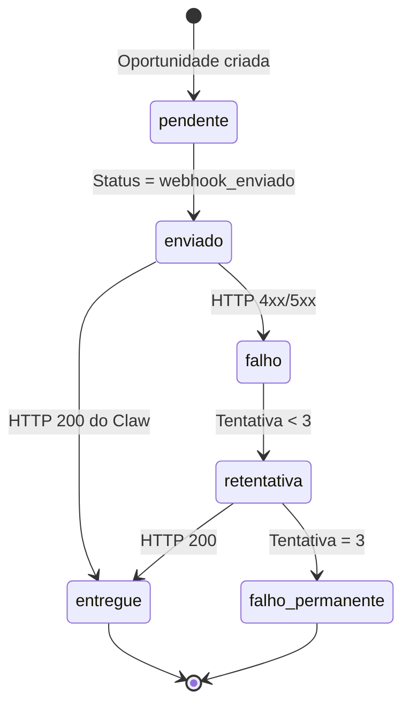
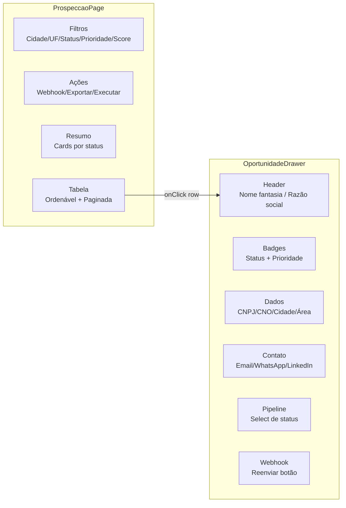

# Módulo de Prospecção CNPJ × CNO

> **Versão:** 1.0  
> **Status:** Produção  
> **Stack:** Python (FastAPI) + React (TanStack Query) + Supabase (PostgreSQL)  

---

## 1. Visão Geral

O módulo de Prospecção cruza em tempo real **CNPJs do setor fitness** (entrantes nos últimos 90 dias) com **obras do CNO** (Cadastro Nacional de Obras) em andamento ou finalizadas na mesma cidade. O resultado é uma lista qualificada de oportunidades com score de match, dados de contato e pipeline de vendas integrado.

### Casos de uso principais

1. **Operador comercial** identifica academias em construção antes da concorrência
2. **SDR** qualifica leads e avanca o status no pipeline (novo → fechado)
3. **Sistema automático** dispara webhooks para o CRM (Claw/OpenClaw) quando uma oportunidade atinge "webhook_enviado"
4. **Gestor** exporta a lista para Excel/CSV e acompanha métricas do funil

---

## 2. Arquitetura de Alto Nível

```mermaid
graph TB
    subgraph "Fontes de Dados"
        RFB[RFB / CNPJ Fitness<br/>entrantes ≤90 dias]
        CNO[CNO / Obras<br/>em_curso | encerrada]
        APOLLO[Apollo.io<br/>enriquecimento contato]
    end

    subgraph "Backend Python"
        ENGINE[prospecting.engine<br/>cruzamento + scoring]
        API[FastAPI /api/prospeccao/*]
        WEBHOOK[prospecting.webhook<br/>dispatch para Claw]
    end

    subgraph "Banco de Dados"
        SUPABASE[(Supabase PostgreSQL)]
        TBL_OPP[oportunidades_prospeccao]
        TBL_LOG[webhook_claw_log]
    end

    subgraph "Frontend React"
        PAGE[ProspeccaoPage.tsx]
        DRAWER[OportunidadeDrawer.tsx]
        HOOKS[useProspeccao.ts<br/>TanStack Query]
    end

    subgraph "CRM Externo"
        CLAW[Claw / OpenClaw<br/>webhook inbound]
    end

    RFB --> ENGINE
    CNO --> ENGINE
    ENGINE --> TBL_OPP
    APOLLO --> ENGINE

    TBL_OPP --> API
    API --> HOOKS
    HOOKS --> PAGE
    PAGE --> DRAWER

    TBL_OPP --> WEBHOOK
    WEBHOOK --> CLAW
    WEBHOOK --> TBL_LOG
```

---

## 3. Fluxo de Dados: CNPJ → CNO → Oportunidade



### Regras de Scoring (score_match)

| Fator | Peso | Lógica |
|---|---|---|
| Área da obra | 30% | > 500 m² = pontuação máxima |
| Situação da obra | 25% | `em_curso` vale mais que `encerrada` |
| Segmento CNPJ | 20% | Academia / studio fitness = match direto |
| Bairro cruzado | 15% | CNPJ e CNO no mesmo bairro |
| Idade da obra | 10% | Obras mais recentes (≤ 6 meses) |

---

## 4. Pipeline de Vendas (Status)



### Transições disponíveis na UI

Tanto na **tabela** (ações rápidas) quanto no **drawer** há um `<Select>` que permite mudar o status de qualquer oportunidade. A mudança:

1. Chama `PATCH /api/prospeccao/oportunidades/{id}/status`
2. Atualiza o registro no Supabase
3. Invalida o cache do TanStack Query
4. Exibe toast de sucesso

---

## 5. Fluxo do Webhook



### Payload do webhook

```json
{
  "event": "oportunidade.webhook_enviado",
  "oportunidade": {
    "id": "uuid",
    "cnpj": "12.345.678/0001-99",
    "razao_social": "ACADEMIA FORTE LTDA",
    "cidade": "Fortaleza",
    "uf": "CE",
    "score_match": 0.87,
    "status": "webhook_enviado",
    "contato_cnpj": {
      "decision_maker": "João Silva",
      "cargo": "Sócio-administrador",
      "email": "joao@academiaforte.com.br",
      "whatsapp_link": "https://wa.me/5585999999999"
    }
  }
}
```

---

## 6. Estrutura do Banco de Dados



### Índices criados

```sql
CREATE INDEX idx_oportunidades_status ON oportunidades_prospeccao(status);
CREATE INDEX idx_oportunidades_cidade ON oportunidades_prospeccao(cidade);
CREATE INDEX idx_oportunidades_match ON oportunidades_prospeccao(score_match DESC);
CREATE INDEX idx_oportunidades_cnpj ON oportunidades_prospeccao(cnpj);
CREATE INDEX idx_oportunidades_created_at ON oportunidades_prospeccao(created_at DESC);
```

---

## 7. API Endpoints

| Método | Endpoint | Descrição |
|---|---|---|
| `POST` | `/api/prospeccao/executar` | Dispara engine de cruzamento em background |
| `GET` | `/api/prospeccao/oportunidades` | Lista com filtros e paginação |
| `GET` | `/api/prospeccao/oportunidades/{id}` | Detalhe de uma oportunidade |
| `POST` | `/api/prospeccao/oportunidades/{id}/webhook` | Reenvia webhook manualmente |
| `PATCH` | `/api/prospeccao/oportunidades/{id}/status` | Atualiza status do pipeline |
| `POST` | `/api/prospeccao/webhook/configure` | Configura URL do webhook por org |

### Parâmetros de listagem

```typescript
interface ProspeccaoFilters {
  cidade?: string
  uf?: string
  status?: string
  prioridade?: string
  score_min?: number
  limit?: number   // default 20
  offset?: number  // default 0
}
```

---

## 8. Frontend — Componentes e Hooks



### Hook `useProspeccao.ts`

```typescript
// Listagem paginada
useOportunidades({ cidade, uf, status, prioridade, score_min, limit, offset })

// Detalhe individual
useOportunidade(id)

// Executar prospecção em background
useExecutarProspeccao()

// Reenviar webhook manualmente
useReenviarWebhook()

// Mudar status do pipeline
usePatchStatusOportunidade()
```

---

## 9. Fluxo de Uso do Usuário



---

## 10. Configuração e Deploy

### 10.1 Banco de dados

Execute a migration:

```bash
psql $DATABASE_URL -f db/migrations/20260529_prospeccao_oportunidades.sql
```

### 10.2 Variáveis de ambiente

```bash
# Backend (.env)
SUPABASE_URL=https://<ref>.supabase.co
SUPABASE_SERVICE_ROLE_KEY=eyJ...
APOLLO_API_KEY=apk_...          # opcional, para enriquecimento

# Frontend (.env)
VITE_API_BASE_URL=https://api.gymsite.app
```

### 10.3 Configurar webhook do Claw

1. Acesse a tela **Prospecção**
2. Clique em **"Webhook Claw"**
3. Informe o `Org ID` e a `URL do webhook`
4. Salve

Ou via API diretamente:

```bash
curl -X POST https://api.gymsite.app/api/prospeccao/webhook/configure \
  -H "Content-Type: application/json" \
  -d '{"org_id":"uuid-da-org","webhook_url":"https://claw.vectra.app/webhook/prospeccao"}'
```

---

## 11. Métricas e Monitoramento

| Métrica | Fonte | Onde ver |
|---|---|---|
| Total de oportunidades | `COUNT(*)` oportunidades_prospeccao | Cards no topo da página |
| Taxa de conversão | `fechado / total` | Calcular manualmente ou exportar CSV |
| Tempo médio no pipeline | `updated_at - created_at` por status | Query no Supabase |
| Taxa de sucesso de webhook | `webhook_claw_log` HTTP 2xx / total | Query no Supabase |
| Score médio | `AVG(score_match)` | Query no Supabase |

---

## 12. Roadmap Futuro

- [ ] **Filtro por intervalo de datas** (created_at entre de/até)
- [ ] **Ações em massa** (selecionar múltiplas linhas + mudar status)
- [ ] **Auto-refresh** a cada 30s quando houver jobs em execução
- [ ] **Gráfico de funil** (visualização tipo dashboard)
- [ ] **Notificações em tempo real** (SSE quando nova oportunidade entra)
- [ ] **Integração com WhatsApp Business API** para disparo direto

---

## Anexos

### A. Diagrama de Estados do Webhook



### B. Diagrama de Componentes do Frontend


