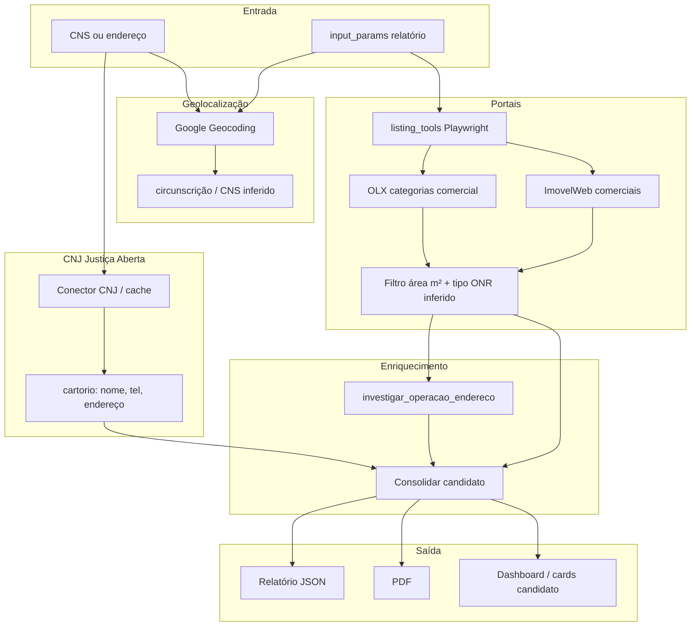

# PRD — Módulo de busca e enriquecimento de imóveis comerciais

**Produto:** GymSite Intelligence (app web existente)  
**Versão:** 1.0 (foco incremental — não replatform)  
**Data:** 2026-05-28  
**Relacionado:** [INVESTIGACAO_IMOVEL.md](./INVESTIGACAO_IMOVEL.md) · [listing_sources.md](./listing_sources.md) · [PDF_RELATORIO.md](./PDF_RELATORIO.md)

---

## 1. Objetivo

Enriquecer relatórios de prospecção de **pontos comerciais para academias** com:

| Fonte | Dado |
|-------|------|
| **CNJ — Sistema Justiça Aberta** | Cartório de Registro de Imóveis da circunscrição: **CNS**, nome, telefone, endereço, horário (dados públicos da serventia). |
| **Portais imobiliários** | Anúncios **ativos** de aluguel/venda, filtrados por cidade, área (m²) e **tipo comercial** alinhado à taxonomia ONR. |
| **Investigação web** (já em produção) | O que **opera hoje** no endereço do candidato (complemento aos portais). |

**Fora de escopo deste PRD:** analytics agregados ONR (Indicador Real API para cartórios), matrícula online, certidões, CNPJ/CNO (módulos já existentes no pipeline A0/A1).

---

## 2. Escopo

### 2.1 Tipos de imóvel comercial (`tipo_imovel_codigo_onr`)

Referência ONR / investigação — ver [INVESTIGACAO_IMOVEL.md](./INVESTIGACAO_IMOVEL.md).

| Código | Tipo | Portais (categoria aproximada) |
|--------|------|------------------------------|
| **31** | Galpão | OLX: Galpões e Depósitos · ImovelWeb: Comerciais (filtro título) |
| **33** | Prédio Comercial | ImovelWeb/OLX: “prédio”, “edifício inteiro” |
| **15** | Loja | OLX: Lojas/Salas e Pontos Comerciais |
| **17** | Sala | OLX: Lojas/Salas · ImovelWeb: Comerciais |
| **71** | Terreno/Fração | ImovelWeb/OLX: terreno, lote (menor prioridade academia) |

**Nota:** portais **não** retornam código ONR; o app **infere** `tipo_imovel_codigo_onr` do título/categoria (`tools/investigacao_context.inferir_tipo_imovel_candidato`).

### 2.2 Entrada

- **CNS** (6 dígitos) → cartório direto.  
- **Endereço** (bairro, cidade, UF) → geocode → circunscrição → CNS (quando base CNJ permitir).  
- **Relatório existente** → `input_params` (cidade, bairro, UF, `area_m2_min`, `area_m2_max`, `tamanho_preset`).

### 2.3 Saída

- Candidato enriquecido: listing + cartório + investigação site.  
- Status consolidado por imóvel: **Locação** | **Venda** | **Não listado** | **Incerto**.  
- Export: **JSON** (API/Supabase) + **PDF** (já suportado — ver [PDF_RELATORIO.md](./PDF_RELATORIO.md)).

---

## 3. Stakeholders

| Stakeholder | Interesse |
|-------------|-----------|
| Usuário do app | Relatório com imóveis reais + contato cartório + “quem opera no endereço”. |
| Equipe técnica | Conectores estáveis, cache, observabilidade. |
| CNJ / Corregedoria | Dados públicos Justiça Aberta (Provimento 149/2023). |
| Portais | Termos de uso; sem API oficial OLX/ImovelWeb para terceiros. |

---

## 4. Estado atual no código (AS-IS)

| Requisito PRD | Status | Onde |
|---------------|--------|------|
| RF03 Portais OLX + ImovelWeb | ✅ Produção | `tools/listing_tools.py`, `tools/imobiliaria_scraper.py`, A1 `anchoring_tools` |
| RF04 Filtro área m² | ✅ | `input_params.area_m2_min/max` → scraper |
| RF04 Tipo comercial ONR | 🟡 Heurístico | `tipo_imovel_inferido` — não filtro nativo do portal |
| RF01 Endereço | ✅ | Geocode A1 `maps_tools.geocode_endereco` |
| RF01 CNS → CNJ | ❌ Não implementado | Roadmap deste PRD |
| RF02 Nome/telefone cartório | ❌ | — |
| RF05 Dashboard status Venda/Locação | 🟡 Parcial | Candidatos no relatório; sem tela dedicada “enriquecimento” |
| RF06 Export JSON/PDF | ✅ JSON relatório · ✅ PDF | `api.py`, `pdf/` |
| Investigação “o que opera hoje” | ✅ | `deep_research_tool.investigar_operacao_endereco` |
| Zap / VivaReal | ❌ Aposentado | Sobreposição OLX Group — [listing_sources.md](./listing_sources.md) |

---

## 5. Requisitos funcionais (target)

| ID | Requisito | Prioridade | Notas |
|----|-----------|------------|-------|
| **RF01** | Aceitar **CNS** ou **endereço** (cidade, bairro, UF, CEP opcional). | P0 | CNS validação 6 dígitos. |
| **RF02** | Consulta **Justiça Aberta (CNJ)** → `nome_serventia`, `telefone`, `endereco`, `cns`, `horario_atendimento`. | P0 | Ver §8 riscos API. |
| **RF03** | Busca **OLX + ImovelWeb** (aluguel comercial); Zap fora do MVP. | P0 | Já existe; estender metadados. |
| **RF04** | Classificar cada anúncio com `tipo_imovel_codigo_onr` ∈ {15,17,31,33,71}. | P0 | Expandir keywords + categoria portal. |
| **RF05** | Campo `status_mercado`: `locacao` \| `venda` \| `nao_listado` \| `incerto`. | P1 | Parser URL/título portal. |
| **RF06** | Anexar bloco `cartorio` e `listings` ao candidato / relatório. | P0 | Schema Supabase + A6. |
| **RF07** | Cruzar listing × investigação × cartório (mesmo endereço/CEP). | P1 | Normalização endereço. |
| **RF08** | Cache TTL: listings 24h, CNJ 7d. | P1 | `tools/cache_store.py` ou tabela dedicada. |

---

## 6. Requisitos não funcionais (ajustados à realidade)

| ID | Original | Ajuste realista |
|----|----------|-----------------|
| RNF01 | LGPD | OK — não persistir dados pessoais de terceiros além do necessário; logs sem CPF. |
| RNF02 | 5s por consulta | **CNJ (cache):** ≤ 2s · **Listings (Playwright):** 30–180s por cidade (async, background) · **Investigação:** até 180s/imóvel (env). |
| RNF03 | 99% disponibilidade | API FastAPI + fila de jobs para scrapers; degradar graciosamente se portal 403. |
| RNF04 | GCP | Docker local + Cloudflare tunnel hoje; migrar scraper para Cloud Run job opcional. |

---

## 7. Fluxo alvo



### Sequência (relatório completo)

1. Usuário dispara relatório (cidade, bairro, UF, área, preset).  
2. **Paralelo:** A0 contexto · **CNJ** (CNS da comarca ou por geocode).  
3. A1: listings OLX/ImovelWeb + âncoras Places.  
4. Marcar gatilhos → **investigação web** (até 5 imóveis).  
5. A2–A6: demografia, competição, financeiro, contato, consolidado.  
6. Export PDF com `tipo_imovel_codigo_onr`, `status_mercado`, `cartorio`.

---

## 8. CNJ — Justiça Aberta (especificação técnica)

### O que é

- Portal: [https://justicaaberta.cnj.jus.br/](https://justicaaberta.cnj.jus.br/)  
- Documentação: [Portal CNJ — Justiça Aberta](https://www.cnj.jus.br/corregedoriacnj/justica-aberta/)  
- **CNS** = Código Nacional de Serventia (6 elementos, identificador estável da serventia).

### O que NÃO confundir

| Sistema | Papel |
|---------|--------|
| **CNJ Justiça Aberta** | Cadastro **público** da serventia (nome, telefone, endereço). |
| **ONR / Registro de Imóveis** | Operação registral, APIs de cartório (Indicador Real, certidão, etc.). |

O PRD de enriquecimento usa **CNJ para contato do cartório**; ONR continua em outros módulos (CNO, integração futura).

### Conector proposto (MVP)

```
tools/cnj_justica_aberta.py
  resolver_cartorio_por_cns(cns: str) -> CartorioInfo
  resolver_cartorio_por_municipio(cidade, uf, tipo="registro_imoveis") -> list[CartorioInfo]
```

**Opções de implementação (ordem):**

1. **API REST oficial** — se CNJ publicar endpoint público pós-atualização 2026 (monitorar).  
2. **Base estática** — dump periódico Corregedoria / ARIPAR (CSV) + refresh semanal.  
3. **Scraping controlado** do portal público (último recurso; frágil).

**Risco:** plataforma em atualização ([comunicado ONR/CNJ](https://www.registrodeimoveis.org.br/sistema-justica-aberta-esta-sendo-atualizado)) — prever fallback “cartório não disponível”.

---

## 9. Portais imobiliários

### MVP (já adotado)

| Portal | Método | Categorias comerciais |
|--------|--------|------------------------|
| **OLX** | Playwright | `lojas-salas-e-pontos-comerciais`, `galpoes-e-depositos` |
| **ImovelWeb** | Playwright | `comerciais-aluguel-{uf}-{cidade}` |

### Fase 2

| Portal | Status | Motivo |
|--------|--------|--------|
| **Zap / VivaReal** | Adiado | Mesmo grupo OLX; instabilidade URL; ver listing_sources |

### Mapeamento portal → `tipo_imovel_codigo_onr`

| Sinal no anúncio | Código |
|------------------|--------|
| categoria OLX galpões | 31 |
| título “galpão”, “depósito” | 31 |
| título “prédio comercial”, “edifício” | 33 |
| categoria OLX lojas/salas | 15 ou 17 (refinar por m² e título) |
| “terreno”, “lote” | 71 |

Persistir em listing: `tipo_imovel_codigo_onr`, `tipo_imovel_label`, `modalidade` (`locacao`|`venda`).

---

## 10. Modelo de dados (extensão candidato)

```json
{
  "listing_id": "3032295652",
  "listing_url": "https://...",
  "tipo_imovel_codigo_onr": 31,
  "tipo_imovel_label": "Galpão",
  "modalidade": "locacao",
  "status_mercado": "locacao",
  "area_estimada_m2": 1200,
  "cartorio": {
    "cns": "123456",
    "nome": "1º Registro de Imóveis de Fortaleza",
    "telefone": "+55 85 ...",
    "endereco": "...",
    "fonte": "cnj_justica_aberta",
    "consultado_em": "2026-05-28"
  },
  "investigacao_site": {
    "status_operacao": "vago",
    "operador_atual": null,
    "tipo_imovel_codigo_onr": 31
  }
}
```

---

## 11. Critérios de aceite

- [ ] Dado **CNS** válido → retorna nome e telefone do cartório (ou erro explícito se CNJ indisponível).  
- [ ] Relatório Fortaleza/Meireles 800–1500 m² → ≥ 1 listing com `tipo_imovel_codigo_onr` em {31,33,15,17}.  
- [ ] Cada listing no top 3 exibe `modalidade` e link ativo.  
- [ ] Investigação preenche `status_operacao` quando gatilho disparado.  
- [ ] PDF exporta seção cartório + tabela candidatos com tipo ONR.  
- [ ] Pipeline completa sem falhar se CNJ estiver fora (degradação).

---

## 12. Riscos

| Risco | Mitigação |
|-------|-----------|
| CNJ sem API pública REST | Base estática + cache; contato CNJ para API. |
| Portal 403 / anti-bot | Playwright; rate limit; cache 24h. |
| Anúncio desatualizado | `investigacao_site` + data_coleta listing. |
| RNF 5s irreal para scrape | Jobs assíncronos; UI com progresso. |
| Divergência cartório × mercado | Mostrar ambas fontes com `fonte` e timestamp. |

---

## 13. Roadmap de implementação

| Fase | Entrega | Esforço |
|------|---------|---------|
| **0** | Documentação ONR + investigação (feito) | — |
| **1** | `cnj_justica_aberta.py` MVP (CNS → cartório) + cache | M |
| **2** | `tipo_imovel_codigo_onr` + `modalidade` no scraper listings | S |
| **3** | `status_mercado` + merge cartório no A6/PDF | M |
| **4** | Tela/dashboard “Enriquecimento” (opcional) | L |
| **5** | Zap se demanda e estabilidade URL | L |

---

## 14. Próximos passos imediatos

1. Validar com CNJ/ARIPAR se existe **endpoint público** pós-`justicaaberta.cnj.jus.br` (2026).  
2. Implementar **Fase 1** (`tools/cnj_justica_aberta.py`) com teste CNS Fortaleza.  
3. Estender **listing_tools** para gravar `tipo_imovel_codigo_onr` e `modalidade`.  
4. Rebuild API Docker após cada fase.

---

## 15. Referências

- [INVESTIGACAO_IMOVEL.md](./INVESTIGACAO_IMOVEL.md) — `tipo_imovel_codigo_onr` e tamanho (porte CNO).  
- [listing_sources.md](./listing_sources.md) — OLX / ImovelWeb / Zap.  
- [CNO_INTEGRACAO.md](./CNO_INTEGRACAO.md) — obras e área m².  
- CNJ: [Justiça Aberta](https://www.cnj.jus.br/corregedoriacnj/justica-aberta/)  
- ONR (outro fluxo): [Integração API Indicador Real](https://www.registrodeimoveis.org.br/integracao-api-indicador-real)
