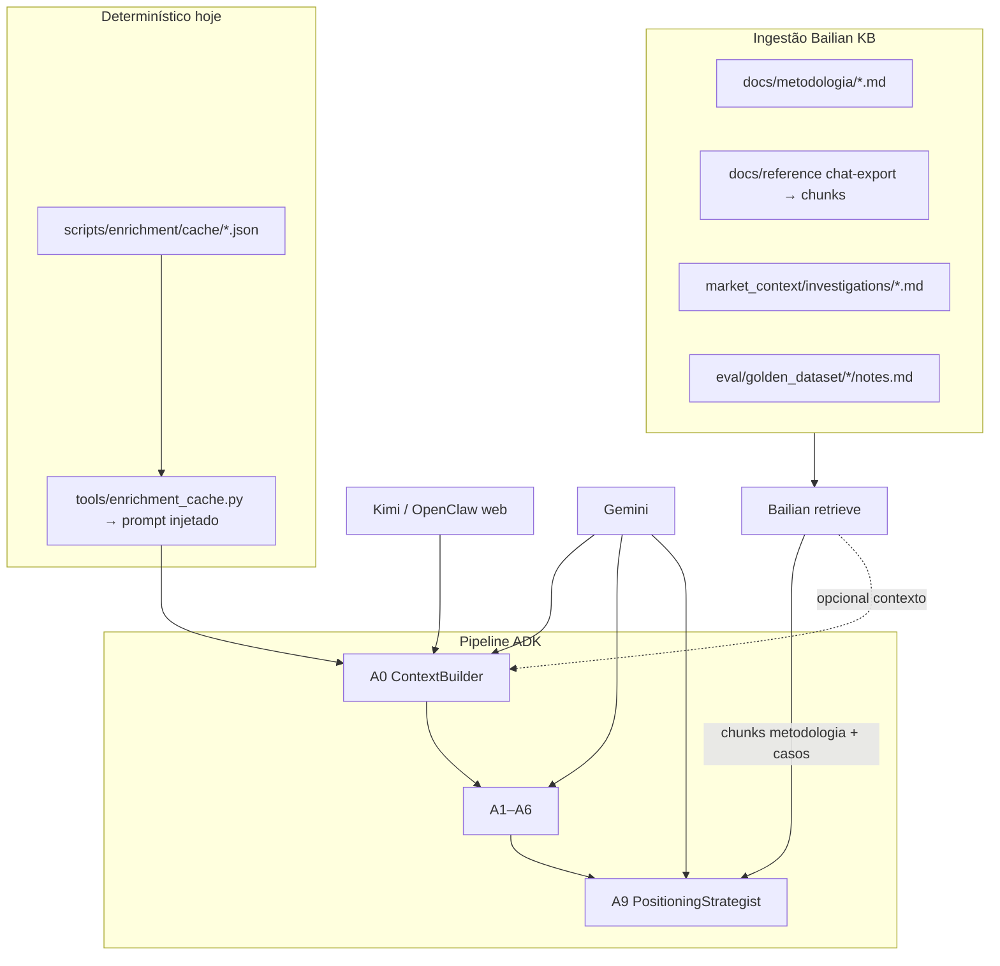

# Qwen + Bailian RAG — Arquitetura no GymSite

Documento de referência: como a **metodologia Qwen** (oceano vermelho/azul), **Kimi** (pesquisa web) e **Bailian RAG** (conhecimento indexado) se relacionam com o pipeline ADK atual.

**Skill Alibaba:** [Bailian RAG Knowledge Base](https://skills.alibabacloud.com/skills/alibabacloud-bailian-rag-knowledgebase)  
**Docs:** [Model Studio RAG](https://www.alibabacloud.com/help/en/model-studio/rag-knowledge-base)

---

## Três papéis (não competem entre si)

| Camada | O que é | No repo hoje | Runtime |
|--------|---------|--------------|---------|
| **Qwen (metodologia)** | Taxonomia de mercado + framework ERRC / 5 GAPs / oceano | `docs/metodologia/`, `data/market_waves.csv` → `tier_qwen`, `market_wave` | **Não** — só catálogo e docs |
| **Kimi** | Pesquisa web / mercado em tempo real | `tools/kimi_research.py`, `A0_RESEARCH_PROVIDER=kimi` | **Sim** (A0 opcional) |
| **Bailian RAG** | Retrieve de chunks (PDF/MD) antes do LLM | **Não implementado** | Piloto futuro |
| **Gemini ADK** | Pipeline A0–A9 produção | `gymsite_intelligence/agent.py`, A9 = `gemini-3.6-flash` | **Sim** (default) |

O run local (`run_market_wave.py --mode local`) usa **Gemini em todo o pipeline**; `tier_qwen=capital_bairro` vem do CSV, não de uma chamada Qwen.

---

## Fluxo alvo (fase piloto)



**Regra:** RAG **complementa** — não substitui Supabase, Redis, nem o cache geo (`enrichment_cache`).

---

## O que o run local já gera (Parangaba / onda vermelha)

| Artefato | Onde | Uso futuro na KB |
|----------|------|------------------|
| `relatorio_outputs.posicionamento_estrategico` | Supabase | **Saída** (não ingest) — golden para eval |
| `market_context/investigations/chij*_parangaba*.md` | Disco | **Ingest** — casos por endereço |
| `metrics/relatorios/<id>.json` | Disco local | Debug / eval |
| `market_wave`, `market_tier_qwen` | `relatorios` | Metadados Atlas (`capital_bairro`) |
| Cache enrichment | `scripts/enrichment/cache/fortaleza_parangaba_ce.json` | Paralelo ao RAG (dados tabulares OSM/aluguel) |

Depois do local: comparar A9 (`veredito_posicionamento`, GAPs) com hipótese do CSV: *"Saturação alta; ressalvas low-cost"*.

---

## Corpus sugerido para a Knowledge Base

### Bucket A — Metodologia (prioridade 1)

- `docs/metodologia/POSITIONING_FRAMEWORK.md`
- `docs/metodologia/analise_precificacao_oceano_azul.md`
- `docs/metodologia/analise_gymsite_posicionamento.md`
- `docs/metodologia/analise_mercado_fitness_fortaleza.md` (exemplos Eusébio/Aldeota/Meireles)

**Metadata por chunk:** `tier_qwen`, `wave` (red|blue|transition), `tipo=metodologia`

### Bucket B — Investigações (prioridade 2)

- `market_context/investigations/*.md`
- `market_context/{cidade}_{bairro}.md` (Deep Research A0)

**Metadata:** `cidade`, `uf`, `bairro`, `tipo=investigacao`

### Bucket C — Golden / Atlas (prioridade 3)

- `eval/golden_dataset/*/notes.md`
- Resumos exportados do chat Qwen → **chunks**, não o JSON inteiro (`docs/reference/chat-export-*.json`)

**Metadata:** `golden_anchor`, `wave`, `tier_qwen`

---

## Onde plugar `retrieve()` no código

| Agente | Query de retrieve (exemplo) | Objetivo |
|--------|----------------------------|----------|
| **A9** | `"{cidade} {bairro} ERRC GAPs oceano vermelho tier {tier_qwen}"` | Alinhar veredito à metodologia + casos similares |
| **A0** (opcional) | `demografia fitness {bairro} {uf}` | Reduzir contradição A0 vs A6 |
| **A6** (não no piloto) | — | Consolidador já longo; manter Gemini |

Hook proposto (fase 2):

1. `tools/bailian_kb.py` — `retrieve(query, top_k=5, filters={})`
2. `agents/a9_positioning_strategist.py` — `before_model_callback` injeta bloco `## Contexto metodológico (RAG)`
3. Env: `DASHSCOPE_API_KEY`, `BAILIAN_KB_ID` (ou index id do console)

---

## Qwen como modelo (fase 3, após RAG)

Opções via **DashScope / Bailian** (mesma conta Alibaba):

| Uso | Modelo candidato | Troca |
|-----|------------------|-------|
| A9 estratégico | `qwen-max` / `qwen-plus` | Avaliar vs `gemini-3.6-flash` no golden |
| Sumarizar investigations | `qwen-turbo` | Offline, ingest na KB |
| A0 | Manter **Kimi** ou Gemini | Qwen sem web nativa fraca para A0 |

**Critério de promoção:** eval A9 PASS nos 10 `market_waves.csv` com custo ≤ Gemini e sem regressão de JSON schema.

---

## Comparativo com o que já existe

| Necessidade | Solução atual | Com Bailian RAG |
|-------------|---------------|-----------------|
| OSM, aluguel portais, BCB | `enrichment_cache` + tools | Sem mudança |
| Pesquisa mercado aberta | Gemini Deep Research / Kimi A0 | Kimi + chunks metodologia |
| Posicionamento ERRC | A9 prompt estático + state A0–A6 | A9 + retrieve casos/tiers |
| Taxonomia ondas | `tier_qwen` no CSV | Filtro na retrieve + UI Atlas |
| Chat Qwen 900 KB | `docs/reference/*.json` ilegível | Chunks na KB |

---

## Fases de implementação

| Fase | Entrega | Esforço |
|------|---------|---------|
| **0** (hoje) | Metodologia em git; A9 Gemini; `tier_qwen` no Atlas | Feito |
| **1** | Console Bailian: criar KB, upload Bucket A | ~2h manual |
| **2** | `tools/bailian_kb.py` + injeção A9 + env example | ~1 PR |
| **3** | Ingest Bucket B (investigations) + filtros `bairro` | Automatizar script |
| **4** | Piloto A9 Qwen + eval golden | Só se fase 2 PASS |

---

## Variáveis de ambiente (piloto)

```env
# Alibaba Model Studio / DashScope
DASHSCOPE_API_KEY=
BAILIAN_KB_ID=           # id da knowledge base no console
BAILIAN_RAG_TOP_K=5
BAILIAN_RAG_ENABLED=false  # feature flag A9

# Já existentes
A0_RESEARCH_PROVIDER=gemini   # ou kimi
KIMI_BACKEND=groq               # openclaw_kimi_server
```

---

## Relacionados

- [MARKET_ATLAS_MASTER_PLAN.md](./MARKET_ATLAS_MASTER_PLAN.md) — ondas e `tier_qwen`
- [POSITIONING_FRAMEWORK.md](./metodologia/POSITIONING_FRAMEWORK.md) — spec A9
- [INTEGRATION_KIMI.md](./INTEGRATION_KIMI.md) — A0 Kimi
- `tools/enrichment_cache.py` — cache determinístico (não confundir com RAG semântico)
- README backlog **VEC-421** — RAG pgvector fornecedores (outro domínio: CAPEX)
