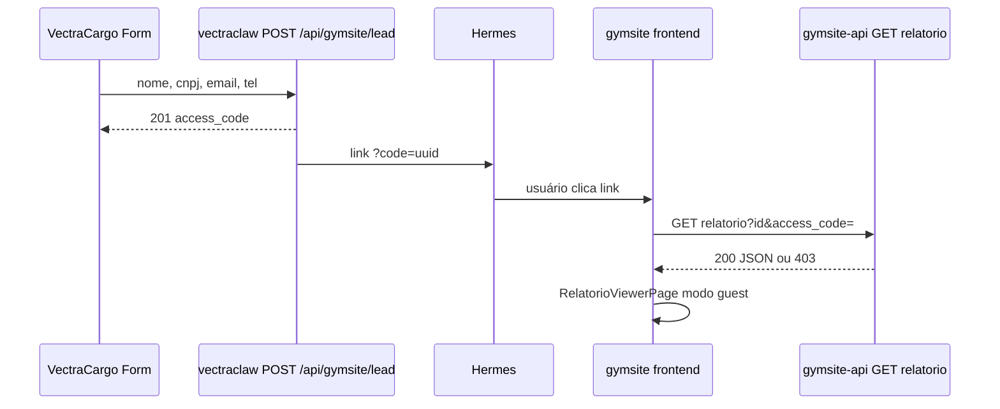

# Refatoração de frontend — inspiração Kimi + gaps no plano MVP

**Data:** 2026-05-23  
**Fonte de inspiração:** `Kimi_Agent_Probabilidade de Sorteio.zip` (protótipo React “GymSite × Imonil” + 3 PNGs de consórcio)  
**Plano de referência:** [`MVP-PRD-v1.1-ISSUES.md`](./MVP-PRD-v1.1-ISSUES.md)  
**Frontend atual:** `frontend/` (TanStack Router, Supabase Auth, viewer A0–A6)

---

## 1. Resumo executivo

O ZIP do Kimi **não é** uma refatoração do repositório atual. É um **protótipo paralelo** (CRM de imóveis/leads) que reimplementa **no client** pedaços do que o GymSite já faz no **backend** (A4 + `recalcula-cenario-com-kit.ts`).

**Valor como inspiração:** padrões de UX (dashboard KPI, modal de detalhe, overlay de relatório financeiro rápido, gráfico CAPEX, bloco de consórcio), hooks de cache/filtro e separação visual lead → relatório.

**Risco se copiado literalmente:** duplicar lógica financeira no browser, divergir números do A4, e repetir o anti-padrão Kimi (prévia com valores fixos vs relatório com hook).

**Gap crítico no plano MVP:** o PRD declara *“Não está em escopo: construir frontend gymsite”*, mas o **GYM-20** exige `https://gymsite.vectracargo.com.br?code=<uuid>` funcionando. **Não existe issue de frontend** para rota pública, `access_code` no `useRelatorioDetail`, nem landing de lead — só **GYM-18/19** (backend). Isso quebra o e2e na etapa 6.

---

## 2. Inventário do artefato Kimi

| Bloco | Conteúdo | Relevância GymSite |
|-------|----------|-------------------|
| `app/src/hooks/useGymReport.ts` | CAPEX 3 cenários + kits embutidos + consórcio binário | Inspira **UI** de resumo financeiro; **não** copiar fórmulas |
| `app/src/hooks/useLeadCache.ts` | Filtro, sort, KPIs sobre lista | Inspira `useRelatorios` + dashboard futuro |
| `app/src/hooks/useNominatimGeocode.ts` | Cache localStorage 7d, rate limit 1 req/s | Inspira mapa/geocode; já temos coords no JSON A1 |
| `LeadDetail.tsx` + `ReportView.tsx` | Modal z-60 + overlay z-70 | Inspira **fluxo** detalhe → relatório; evitar duplicar números |
| `Dashboard.tsx` | KPI cards, top oportunidades, funil status | Inspira home operacional (não existe hoje) |
| `Layout.tsx` | Sidebar colapsável + tabs | Inspira navegação densa; nosso `AppShell` é topbar |
| `MapView.tsx` | Leaflet dark + pins por lead | Parcialmente coberto por `MapaRelatoriosPage` |
| `SavedSearches.tsx` | Buscas salvas + cron (mock) | Fora do MVP; alinhado a listing scout futuro |
| PNGs raiz | Análise/simulação consórcio | **GAP de produto:** probabilidade de sorteio não está no código Kimi nem no nosso |

**Stack Kimi vs nosso:** React 19 + Vite 7 + shadcn (40+ componentes) vs nosso React + TanStack Router + shadcn enxuto. Kimi usa estado `activeTab` local; nós usamos rotas tipadas (`validateSearch`) — **manter nosso router**.

---

## 3. O que copiar (padrões) vs o que não copiar

### 3.1 Adotar (UX / arquitetura frontend)

| Padrão Kimi | Aplicação no GymSite atual | Onde encaixar |
|-------------|---------------------------|---------------|
| **Overlay de relatório financeiro** em 1 clique | Resumo CAPEX/payback antes de abrir viewer completo | `RelatorioCard` ou drawer em `RelatoriosListPage` |
| **Gráfico de composição CAPEX** (obra / equip / contingência) | Complementar `CenarioFinanceiroTable` (hoje tabelas) | Novo `CapexBreakdownChart.tsx` usando dados de `viabilidade_3_cenarios` |
| **KPI strip** (4 cards no topo do relatório) | Header do viewer já tem veredito; falta strip financeira | `RelatorioViewerPage` seção 6 |
| **Hook de lista com KPI derivado** | `useLeadCache` → inspirar `useRelatoriosKpi()` | `hooks/useRelatorios.ts` ou derivado |
| **Modal de detalhe com mapa embutido** | `CandidatoCard` + mapa; Kimi mostra pin no detalhe do imóvel | `CandidatoCard` ou painel lateral no viewer |
| **Status pipeline visual** (funil) | Leads Imonil → nosso `StatusPipelineBadge` em relatórios | Lista + mapa |
| **Separação z-index** detalhe (60) / relatório (70) | Evitar modais competindo | Padrão global de overlays |
| **Bloco “Consórcio recomendado”** | Produto comercial Vectra; email Hermes cita projeção financeira | Novo card pós-`CenarioFinanceiroTable` (dados do A4 ou regra configurável) |

### 3.2 Não copiar (já temos melhor ou é perigoso)

| Kimi | Por quê evitar | Nosso equivalente |
|------|----------------|-------------------|
| `REAL_KITS` hardcoded em hook | Duplica `frontend/src/data/kits/` + `tools/kits_totais.json` | `getKit`, `recalcularCenariosComKit` |
| `resolveTipo(lead.tipo_imovel)` buscando "crossfit" | Bug: tipo imóvel ≠ tipo negócio | `input_canonico.tipo_negocio` |
| Payback = `capex / (aluguel × 1.5)` | Heurística opaca vs A4 | `payback_meses`, `lucro_mensal_estimado` no JSON |
| FipeZap fixo R$ 55,58/m² | Ignora cidade do relatório | `aluguel_mediana_m2_observado`, A0/A1 |
| Mock KPIs (+8 hoje, 73% cache) | Engana em demo | Métricas reais de API ou omitir |
| App monolítico sem rotas | Perde deep-link, auth, e2e `?code=` | `router.tsx` |
| Recalcular financeiro só no client | Drift com Supabase/A4 | Backend + `recalcula-cenario-com-kit.ts` imutável |

### 3.3 Lição anti-padrão (obrigatória na refatoração)

No Kimi, **`LeadDetail` usa estimativas fixas** enquanto **`ReportView` usa `useGymReport`**. Qualquer refatoração nossa deve seguir a regra:

> **Uma única fonte de verdade por contexto:** JSON do relatório (A6) + override de kit no client; nunca dois cálculos paralelos na mesma jornada.

---

## 4. Mapa de gaps — plano MVP vs realidade frontend

Legenda: ✅ coberto · ⚠️ parcial · ❌ ausente no plano ou no código

| # | Capacidade | PRD MVP | Frontend atual | Inspiração Kimi | Ação sugerida |
|---|------------|---------|----------------|-----------------|---------------|
| G1 | Acesso lead `?code=<uuid>` sem login | GYM-20 passo 6 | ❌ só rotas autenticadas | — | **Nova issue GYM-21** (ver §6) |
| G2 | `GET /api/relatorios/{id}?access_code=` | GYM-19 | ❌ `api.py` sem validação | — | GYM-19 (backend) |
| G3 | `useRelatorioDetail` com `access_code` | — | ❌ sempre auth Supabase | — | GYM-21 |
| G4 | Landing “aguardando relatório” para lead | GYM-20 “ou form de solicitação” | ⚠️ `RelatorioAguardandoPage` exige auth | — | Rota pública `/acesso` |
| G5 | Mensagem pós-form VectraCargo | GYM-11 | N/A (outro repo) | — | GYM-11 |
| G6 | Consórcio / financiamento alternativo | Hermes template (projeção) | ❌ zero UI | `ReportView` bloco consórcio | Pós-MVP ou extensão A4 |
| G7 | Probabilidade contemplação sorteio | Nome do ZIP | ❌ | PNGs apenas | Produto separado; não misturar no MVP |
| G8 | Dashboard operacional (KPIs) | Fora de escopo explícito | ❌ redirect `/` → `/relatorios` | `Dashboard.tsx` | Fase 2 pós-MVP |
| G9 | CRM leads / pipeline imóvel | Fora de escopo | ❌ (somos relatório-centric) | App inteiro Kimi | Não escopo GymSite Intelligence |
| G10 | Gráfico CAPEX visual | — | ⚠️ tabelas ricas, sem chart | Recharts no `ReportView` | Componente domain |
| G11 | Comparador 2 relatórios | — | ✅ `ComparadorPage` | — | Manter |
| G12 | Mapa de relatórios | — | ✅ `MapaRelatoriosPage` | `MapView` | Melhorar pins/legenda |
| G13 | Kits como fonte equipamentos | — | ✅ `KitEquipamentosTable` + recálculo | `useGymReport` | Manter arquitetura atual |
| G14 | Tooltips glossário financeiro | — | ✅ `CenarioFinanceiroTable` | — | Kimi não tem; nosso diferencial |
| G15 | Geocode com cache browser | — | ❌ | `useNominatimGeocode` | Só se mapa precisar endereço livre |
| G16 | Deep link filtros lista | — | ✅ `validateSearch` cidade/veredito | — | Manter |
| G17 | Testes unitários hooks financeiros | — | ❌ | ❌ Kimi também | Adicionar Vitest em `recalcula-cenario-com-kit` |
| G18 | Restrição “não alterar frontend” | CLAUDE.md / GYM-01 | Conflita com G1/G3/G4 | — | **Exceção documentada** para M4 |

### 4.1 Contradição explícita no PRD

```text
Escopo MVP: "Não está em escopo: construir frontend gymsite (já existe completo)"
GYM-20 passo 6: "Acessar gymsite...?code=<uuid> → gymsite valida e exibe relatório"
```

**Conclusão:** o frontend *existe* para usuários logados, mas **não está completo para o fluxo de lead**. A refatoração inspirada no Kimi deve priorizar **jornada pública access_code**, não reescrever o viewer A0–A6.

---

## 5. Melhorias de função (insights além do PRD)

### 5.1 Camada financeira (função de negócio)

| Função | Estado atual | Melhoria inspirada / necessária |
|--------|--------------|--------------------------------|
| 3 cenários low/mid/premium | A4 + `CenarioFinanceiroTable` v2 | Gráfico de barras empilhadas (Kimi `ReportView`) |
| Override kit equipamentos | `recalcularCenariosComKit` | Badge `_ajustado_com_kit` já existe — expor diff % no card |
| Consórcio vs financiamento | Ausente | Card condicional: `capex_mid > threshold` → carta sugerida; **não** recalcular no client sem spec A4 |
| FipeZap / benchmark aluguel | Dados no JSON (`fonte_aluguel`, medianas) | KPI “desvio vs mercado” no header (Kimi faz com constante errada) |
| Sensibilidade / stress | `SensibilidadeStress` no schema | Kimi não tem — manter como diferencial |
| Payback / TIR / VPL | Tooltips no viewer | Kimi só payback simplificado — não regredir |

### 5.2 Camada operacional (futuro Imonil / listings)

O protótipo Kimi antecipa produto **Imonil** (leads OLX/ZAP), não o MVP Vectra lead form:

- `useLeadCache` → futuro módulo se integrarmos listings ao mesmo frontend
- `SavedSearches` + cron → alinhado a `docs/listing_sources.md` (Playwright OLX/ImovelWeb)
- **Não misturar** no mesmo sprint que GYM-21

### 5.3 Camada lead MVP (obrigatória)

Fluxo alvo pós-captação:



**Funções UI necessárias (não no Kimi):**

1. Parser `?code=` na raiz ou `/acesso`
2. Resolver `relatorio_id` (query `?id=` ou path dedicado)
3. `useRelatorioDetail(id, { accessCode })` sem session Supabase
4. Estados: código inválido, relatório pendente (`status !== done`), relatório pronto
5. CTA “Solicitar análise completa” se só tiver stub (GYM-20 alternativa)

---

## 6. Issues incorporadas ao PRD

**Status:** GYM-21, GYM-22 e GYM-23 foram adicionadas a [`MVP-PRD-v1.1-ISSUES.md`](./MVP-PRD-v1.1-ISSUES.md) (M4). Mockup HTML: [`mockups/frontend-mvp-preview.html`](./mockups/frontend-mvp-preview.html).

Referência das specs (também no PRD):

### [ ] GYM-21 — Rota pública lead: `?code=` + viewer guest

- **Owner:** `agente-1` ou humano frontend
- **Labels:** `gymsite` `frontend` `security`
- **Arquivos:** `frontend/src/router.tsx`, `hooks/useRelatorioDetail.ts`, nova `routes/LeadAccessPage.tsx`
- **Blocked by:** GYM-19

**Spec:**
- Adicionar `PUBLIC_PATHS`: `/acesso` (e opcionalmente tratar `/?code=` com redirect)
- `validateSearch`: `code?: string`, `id?: string` (relatorio uuid)
- `useRelatorioDetail`: se `accessCode` presente, `fetch` com `?access_code=` **sem** header Authorization
- UI: loading → viewer simplificado ou `RelatorioViewerPage` com layout guest (sem AppShell/nav)
- Erros: 403 → “Link inválido ou expirado”; 404 → genérico

**Aceite:** GYM-20 passo 6 passa sem login Supabase.

**Restrições:** não duplicar lógica A4; consumir JSON existente.

---

### [ ] GYM-22 — Vincular `gymsite_leads.access_code` → `relatorios.access_code`

- **Owner:** `agente-3` + `agente-1`
- **Blocked by:** GYM-08, GYM-18

**Spec:** documentar como o Morpheus/Hermes obtém `relatorio_id` para o link do e-mail (criar relatório stub com mesmo `access_code` ou tabela de ponte).

**Gap atual:** GYM-06 cria `access_code` em `gymsite_leads`; GYM-18 em `relatorios` — **sem issue de join**.

---

### [ ] GYM-23 — Card Consórcio (UI only, dados A4 ou config)

- **Owner:** `agente-1` (frontend) + decisão produto
- **Blocked by:** — (pode ser pós-MVP)

**Spec:** exibir bloco estilo Kimi `ReportView` quando `output_consolidado` trouxer campos ou regra server-side; botão “Simular” abre modal ou link Vectra — **não** implementar probabilidade de sorteio no client sem modelo estatístico validado.

---

## 7. Plano de refatoração frontend (fases)

### Fase 0 — Desbloquear MVP (obrigatório)

| Item | Esforço | Dependência |
|------|---------|-------------|
| GYM-21 rota pública + hook access_code | 2–4h | GYM-19 |
| GYM-22 vínculo lead ↔ relatório | 1–2h | pipeline Morpheus |
| Ajustar PRD: exceção “frontend M4” na restrição global | 15min | doc |

### Fase 1 — UX financeira (inspiração Kimi, sem duplicar A4)

| Item | Esforço | Arquivo alvo |
|------|---------|--------------|
| `CapexBreakdownChart` (Recharts) | 2h | `components/domain/` |
| KPI strip no viewer (4 métricas) | 1h | `RelatorioViewerPage.tsx` |
| Drawer “resumo financeiro” na lista | 2h | `RelatorioCard.tsx` |
| Unificar badges kit ajustado + diff % | 1h | `CenarioFinanceiroTable.tsx` |

### Fase 2 — Operacional (pós-MVP)

| Item | Nota |
|------|------|
| Dashboard KPI (`useRelatoriosKpi`) | Inspirado `Dashboard.tsx` |
| Nominatim cache | Só se mapa exigir geocode ad-hoc |
| Módulo listings/leads | Produto Imonil; repo ou app separado |

### Fase 3 — Consórcio / sorteio (produto)

- Implementar modelo de probabilidade **no backend** (ou serviço Vectra), consumir no frontend
- PNGs do ZIP como spec visual, não como código

---

## 8. Matriz de equivalência de código

| Conceito | Kimi | GymSite (manter/evoluir) |
|----------|------|--------------------------|
| Entidade central | `Lead` (imóvel) | `Relatorio` + `input_canonico` |
| Lista + filtros | `useLeadCache` | `useRelatorios` + search params |
| Detalhe | `LeadDetail` modal | `RelatorioViewerPage` / `CandidatoCard` |
| Financeiro rápido | `useGymReport` | **Não criar** — usar `output_consolidado.viabilidade_3_cenarios` |
| Financeiro + kit | inline no hook | `recalcularCenariosComKit` |
| Mapa | `MapView` + Leaflet | `MapaRelatoriosPage` |
| Auth | nenhum | Supabase + `RequireAuth` |
| Acesso guest | nenhum | **GYM-21** (gap) |

---

## 9. Checklist de qualidade para qualquer PR inspirado no Kimi

- [ ] Nenhum novo hook recalcula CAPEX/payback sem passar por JSON A4 ou `recalcula-cenario-com-kit.ts`
- [ ] `tipo_negocio` e `tamanho_preset` vêm de `input_canonico`, não de heurística em `tipo_imovel`
- [ ] Rotas públicas documentadas em `PUBLIC_PATHS` e testadas no GYM-20
- [ ] KPIs exibidos têm fonte API ou são omitidos (sem números fake)
- [ ] Modais seguem escala z-index consistente
- [ ] Teste Vitest para funções puras de recálculo (não para componentes shadcn)

---

## 10. Referências rápidas no repositório

| Arquivo | Papel |
|---------|-------|
| `frontend/src/router.tsx` | Rotas públicas vs autenticadas — ponto de extensão GYM-21 |
| `frontend/src/hooks/useRelatorioDetail.ts` | Fetch do relatório — adicionar `access_code` |
| `frontend/src/lib/recalcula-cenario-com-kit.ts` | Cascata financeira client (fonte única pós-A4) |
| `frontend/src/components/domain/CenarioFinanceiroTable.tsx` | UI financeira madura (v2) |
| `frontend/src/routes/RelatorioViewerPage.tsx` | Viewer 12 seções — não substituir por Kimi `ReportView` |
| `api.py` `get_relatorio` | Implementar GYM-19 |
| `docs/MVP-PRD-v1.1-ISSUES.md` | Plano atual — gaps G1, G2, G3, G4, G18, G22 |

---

## 11. Conclusão

O ZIP Kimi serve como **moodboard de UX** (dashboard, overlay financeiro, gráfico CAPEX, consórcio) e como **alerta de arquitetura** (não duplicar cálculos; não confundir lead imóvel com relatório GymSite).

O **maior GAP no plano atual** não é falta de componentes shadcn — é a **ausência de trabalho de frontend no M4** enquanto o e2e (GYM-20) já assume link público com `access_code`. Prioridade zero da refatoração: **GYM-21 + GYM-22**, depois melhorias visuais inspiradas no Kimi sem reimplementar o A4 no browser.
