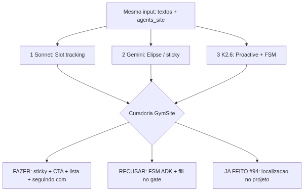
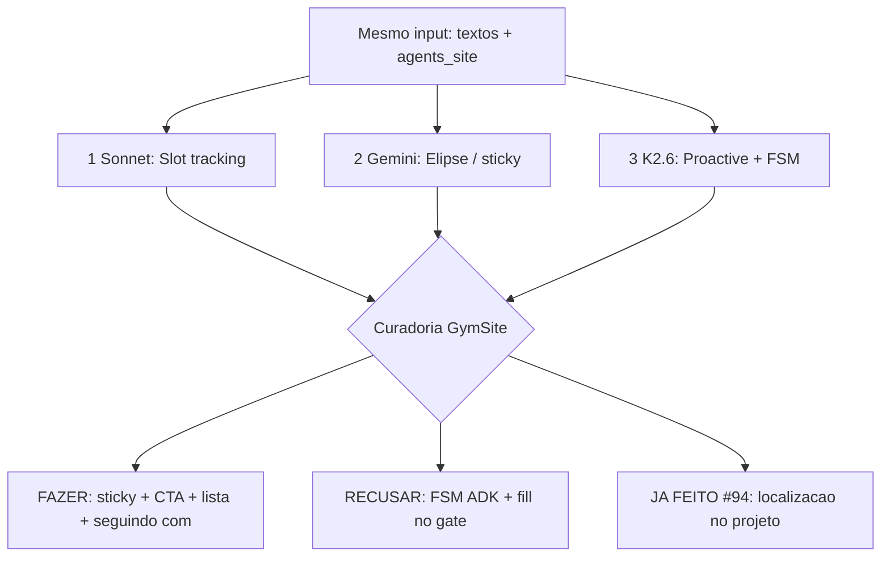
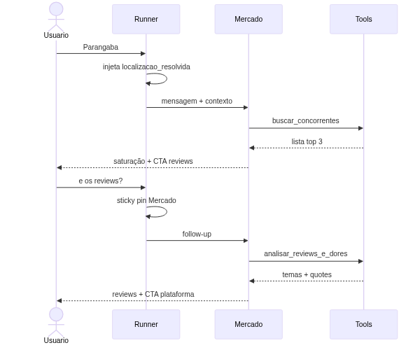
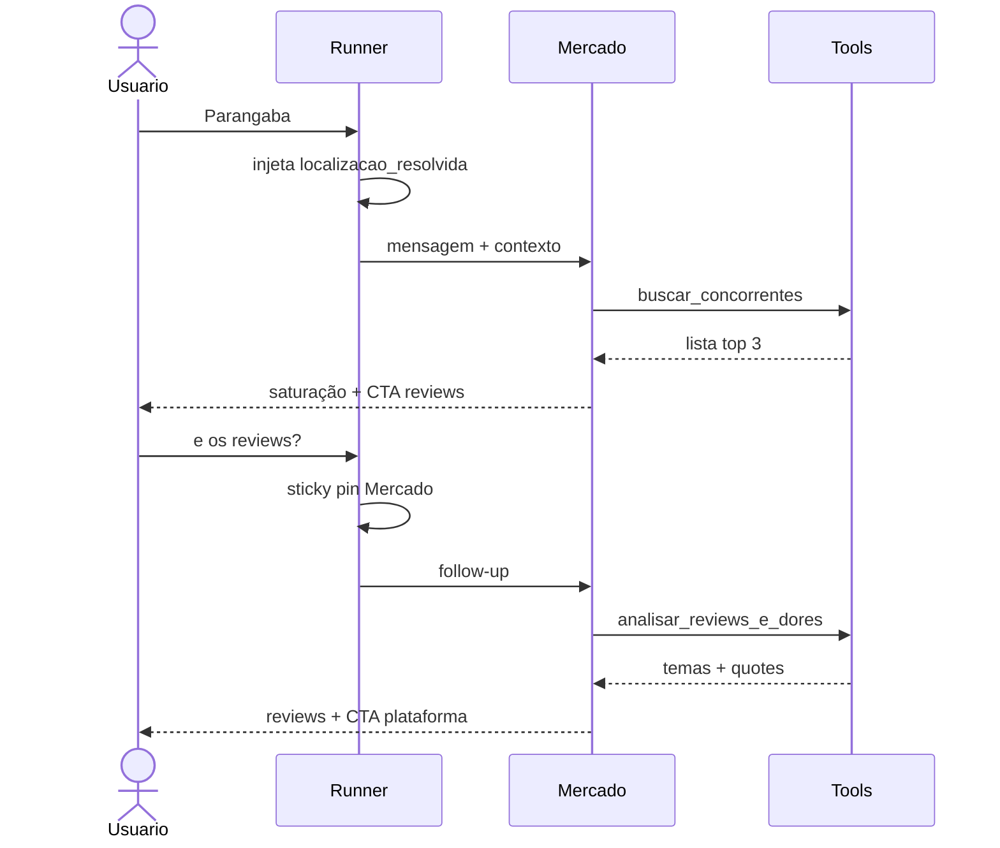
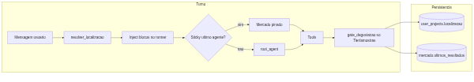
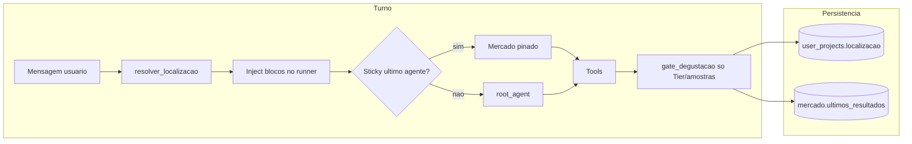
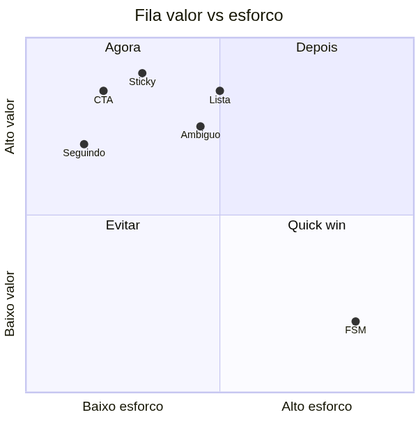
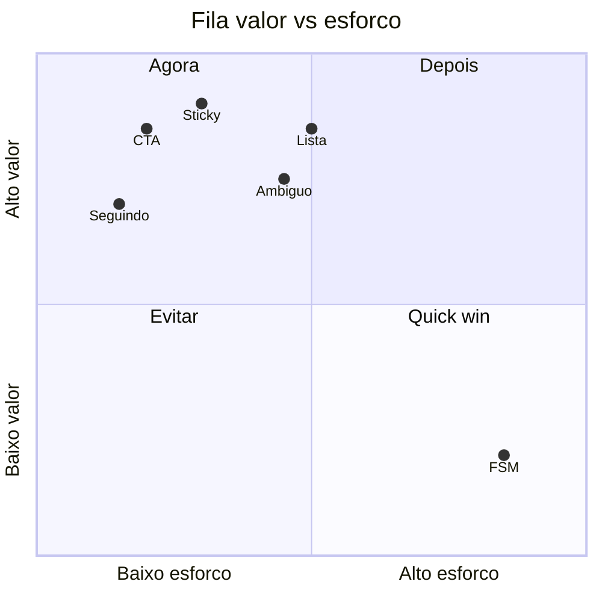

# Decisão de ação — Curadoria PRDs conversacionais

**GymSite · site agent + consultor legado**  
**Data:** 2026-07-14 · **PR:** [#96](https://github.com/Marcelo-Rosas/gymsite/pull/96)

Este é o documento **único** da decisão. Entrada comum aos três modelos: mesmos textos + código `agents_site`. Diagramas roteados pelo script deterministic `tools/mermaid_diagram_router.py` + render Mermaid Chart MCP.

---

## 1. Decisão em uma página

| Decisão | O quê |
|---------|--------|
| **Fazer agora** | (1) Sticky no último especialista · (2) CTA proativo após concorrentes · (3) Lista indexável “o segundo/eles” · (4) Frase “Seguindo com…” |
| **Não fazer** | FSM/`ConversationState` em sessão ADK · Preencher kwargs dentro de `gate_degustacao` · Pattern recognition pesado na degustação |
| **Já feito (#94)** | Localização no `user_projects` + inject `[localizacao_resolvida:]` — não reperguntar bairro/cidade |

**Fonte da verdade do contexto:** `user_projects` (JSONB), **não** `session.state` do ADK (o runner recria `InMemorySessionService` a cada turno).

---

## 2. O que é o 1, o 2 e o 3

| # | Modelo | Nome | Em uma linha |
|---|--------|------|--------------|
| **1** | Claude Sonnet 4.5 médio | Slot tracking | Guardar e reusar bairro/cidade/últimos resultados no estado, auditável. |
| **2** | Gemini 3.1 Pro | Elipse / resiliência | Mensagem curta ou vaga + root que não se perde no follow-up. |
| **3** | Kimi K2.6 | ICL + proactive | Após os dados, oferecer o próximo passo e manter o especialista certo. |

| # | Acertou | Errou / excesso |
|---|---------|-----------------|
| 1 | RF claros; encaixa no #94; lista indexável ainda vale | Quase não fala sticky/CTA |
| 2 | Sticky + desambiguação + KPIs | Fill no `gate_degustacao` (papel errado) |
| 3 | Sticky Mercado + CTA pós-concorrentes | “Código pronto” FSM em ADK some entre turnos |

### Layout — decisão de curadoria
*Router: `intent=fluxo` → `flowchart`*

Preview: https://l.mermaid.ai/dRmlUC

---

## 3. Experiência-alvo (como deve ficar a conversa)

*Router: `intent=sequencia` → `sequenceDiagram`*

Preview: https://l.mermaid.ai/5VZ2KM

---

## 4. Arquitetura canônica (o que construir de verdade)

*Router: `intent=fluxo` → `flowchart`*

Preview: https://l.mermaid.ai/77UP9c

**Regras:**
- `gate_degustacao` continua **só** antifatiamento / Tier 2.
- Fill de localização: `agents_site/localizacao.py` + runner (já parcialmente no #94).
- Sticky: pinagem determinística via último `project_messages.agente` + mensagem curta/follow-up de mercado.

---

## 5. Fila de implementação (ranking unificado)

*Router: `intent=priorizacao` → `quadrantChart`*

Preview: https://l.mermaid.ai/UHx33Q

| Rank | Entrega | Origem | Status |
|------|---------|--------|--------|
| 1 | Sticky → último especialista (esp. Mercado) | #2 + #3 | A fazer |
| 2 | Proactive: 1 CTA após concorrentes | #3 | A fazer |
| 3 | Lista indexável (“o segundo / eles”) | #1 + #3 | A fazer |
| 4 | “Seguindo com Parangaba…” | #1 | A fazer |
| 5 | Desambiguação múltipla escolha (“centro”) | #2 | A fazer |
| 6 | Bloco `[conversa: pending_offer=…]` no JSONB | #3 mínimo | A fazer |
| 7 | Histórico 8 turnos + prompt sticky | #2 | A fazer |
| 8 | Tom direto se msgs curtas (só prompt) | #3 | Polir |
| 9 | Exemplos de elipse nas docstrings | #2 | Polir |
| 10 | Espelho no consultor legado | #1–#3 | Depois |
| — | FSM ADK / fill no gate | #2 F3 / #3 §4 | **Recusar** |
| ✅ | Não reperguntar bairro/cidade | #1–#3 | Feito #94 |

---

## 6. Ranking dos autores (mesmo input)

| Rank | Modelo | Critério |
|------|--------|----------|
| 1 | Sonnet 4.5 médio | Mais cirúrgico e implementável sem reinventar o runner |
| 2 | Gemini 3.1 Pro | Stories/KPIs úteis; 1 erro de arquitetura (F3) |
| 3 | Kimi K2.6 | Boa fatia de fluxo; pior como pacote de eng. (§4) |

---

## 7. Aceite (definição de pronto desta onda)

- [ ] “E os reviews?” / “mensalidade da Smart Fit?” permanece no Mercado.
- [ ] Após listar concorrentes, sempre há **1** CTA (reviews ou plataforma — sem prometer tool bloqueada pelo gate).
- [ ] “O segundo” resolve para o item 2 da última lista daquele bairro.
- [ ] Reuso de slot: resposta reconhece o lugar (“Seguindo com…”).
- [ ] `gate_degustacao` inalterado em responsabilidade.
- [ ] Sem `ConversationState` em memória ADK efêmera.

---

## 8. Metadados dos layouts

| Arquivo | Intent router | Tipo Mermaid | Preview |
|---------|---------------|--------------|---------|
| `assets/curadoria-prds/01-fluxo-decisao.png` | `fluxo` | flowchart | https://l.mermaid.ai/dRmlUC |
| `assets/curadoria-prds/02-sequencia-alvo.png` | `sequencia` | sequenceDiagram | https://l.mermaid.ai/5VZ2KM |
| `assets/curadoria-prds/03-quadrant-fila.png` | `priorizacao` | quadrantChart | https://l.mermaid.ai/UHx33Q |
| `assets/curadoria-prds/04-arquitetura.png` | `fluxo` | flowchart | https://l.mermaid.ai/77UP9c |

Geração: `scripts/batch/render_mermaid_diagram.py --intent … --code … --render --out-png …`

---

## 9. Docs satélite (detalhe)

- [PRD #1 Slot tracking](./PRD_SLOT_TRACKING_CONTEXTO_CONVERSACIONAL.md)
- [PRD #2 Elipse](./PRD_RESILIENCIA_CONTEXTO_ELIPSE.md)
- [PRD #3 ICL/Proactive](./PRD_MELHORIA_CONVERSACIONAL_ICL_PROACTIVE.md)
- [Índice vivo](./CURADORIA_PRDS_AGENTES.md)
